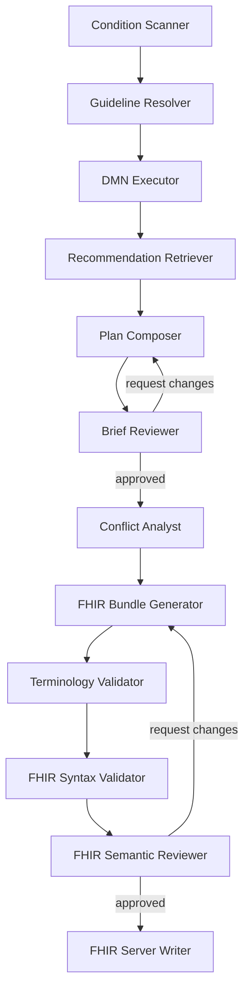
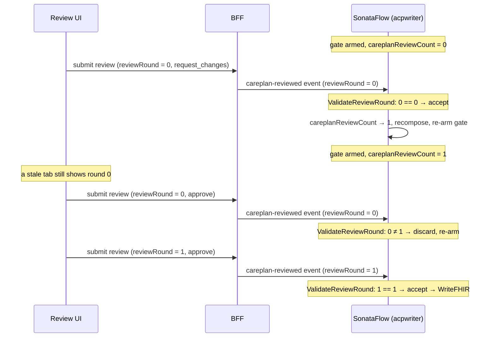

# Actionable Care Plan Writer

Composes patient-specific, FHIR-compliant care plans by combining clinical decision logic (DMN), retrieved recommendations (vector store), and patient data (FHIR IPS). Uses a multi-agent LangGraph pipeline with adversarial review.

## Architecture

Two-phase LangGraph pipeline:

**Phase 1 — Clinical Reasoning:**
1. **Condition Scanner** — Extract patient conditions, medications, allergies from IPS (deterministic)
2. **Guideline Resolver** — Match conditions to registered CPGs and DMN models
3. **DMN Executor** — Evaluate decision models with concept-resolution pipeline for patient data extraction (see [Clinical Data QA](../docs/clinical-data-qa.md)). Uses an LLM (via MaaS/LiteLLM) as the final resolution fallback for open-vocabulary clinical terms; degrades gracefully to deterministic-only extraction when the LLM is unavailable
4. **Recommendation Retriever** — Search vector store for applicable recommendations
5. **Plan Composer** — LLM maps decisions + recommendations → Planning Brief
6. **Brief Reviewer** — Adversarial LLM review (clinical pharmacist persona, max 2 loops)
7. **Conflict Analyst** — LLM flags plan-level conflicts (overlap / contradiction / divergent target / divergent schedule) across the brief's goals and activities; annotates the brief only — never edits goals or activities. See [Conflict surfacing](#conflict-surfacing)

**Phase 2 — FHIR Generation:**
8. **FHIR Bundle Generator** — Deterministic FHIR R4 from Planning Brief (no LLM)
9. **Terminology Validator** — Verify all codes against SNOMED/RxNorm/LOINC/ICD-10
10. **FHIR Syntax Validator** — Structural validation + AI Transparency IG compliance
11. **FHIR Semantic Reviewer** — LLM review for clinical coherence (max 2 loops)
12. **FHIR Server Writer** — POST to HAPI FHIR + approve/reject workflow



### Sub-components

- **`decision-service/`** — Java/Quarkus (Apache KIE / Kogito) DMN engine runtime
- **`src/acp_writer/`** — Python pipeline service

Both the decision engine and vector store are internal implementation details, hidden behind the API.

## Getting Started

```bash
cd acp-writer
python3 -m venv .venv && source .venv/bin/activate
pip install -e "../shared" -e ".[test]"
```

### Run the pipeline via CLI

Requires LiteLLM proxy running:

```bash
LITELLM_URL=http://localhost:4000 acp-writer ../mock-EHR/data/patient-bundle-medication.json
```

### Run tests

```bash
# Unit tests (no external services needed)
pytest tests/ -k "not integration and not network"

# With live terminology servers
pytest tests/ -k "not integration"

# Full E2E (requires LiteLLM)
LITELLM_URL=http://localhost:4000 pytest tests/test_e2e.py -v
```

## API Contract

REST API defined in [`api/openapi.yaml`](api/openapi.yaml). MCP tools in [`api/mcp-tools.json`](api/mcp-tools.json).

### Endpoints

| Group | Endpoints | Purpose |
|---|---|---|
| **Guidelines** | `/api/v1/guidelines` | Register, list, get, delete CPG metadata |
| **Decisions** | `/api/v1/decisions/models`, `.../evaluate/{id}` | Deploy, list, remove, evaluate DMN models |
| **Knowledge** | `/api/v1/knowledge/recommendations`, `.../search` | Ingest, list, search recommendations |
| **Care Plans** | `/api/v1/careplans`, `.../status` | Generate, retrieve, approve/reject care plans |
| **Health** | `/health`, `/health/ready`, `/api/v1/status` | Liveness, readiness, component status |

### MCP Tools

| Tool | Description |
|---|---|
| `deploy_decision_model` | Deploy DMN to the decision engine |
| `list_decision_models` | List deployed models |
| `evaluate_decision` | Evaluate a model with inputs |
| `register_guideline` | Register CPG metadata |
| `ingest_recommendation` | Ingest a single recommendation |
| `ingest_recommendation_batch` | Ingest a RecommendationBundle |
| `search_recommendations` | Search recommendations by similarity |
| `generate_careplan` | Generate a care plan from an IPS Bundle |

## AI Transparency

Every care plan bundle includes:
- **AIAST `meta.security`** on all generated resources
- **AI-Device** resource (AI Transparency IG profile)
- **AI-Provenance** with CPG derivation lineage
- **AI-InputPrompt** DocumentReferences for the captured LLM prompts (when `ACP_CAPTURE_PROMPTS=true`)
- **AI-ModelCard** DocumentReference (when `LLM_MODEL_CARD_URL` is set)
- **Per-activity Provenance** linking each activity to its source recommendation
- **Conflict Provenance** for each detected conflict, carrying an `AIconfidence` extension (see [Conflict surfacing](#conflict-surfacing))
- On approval: AIAST → CLINAST_AIRPT, clinician added as a `verifier` human agent

acp-writer targets the HL7 [AI Transparency on FHIR IG](https://build.fhir.org/ig/HL7/aitransparency-ig). See [`docs/ai-transparency.md`](../docs/ai-transparency.md) for the full conformance inventory, the conflict-Provenance pattern, and the custom extension table.

### Conflict surfacing

The **Conflict Analyst** node inspects the composed Planning Brief and flags plan-level conflicts an LLM can reasonably judge — it applies no clinical knowledge base and runs no DMN. Categories:

| Category | Meaning |
|---|---|
| `overlap` | Two guidelines contribute substantially-the-same activity (e.g. both recommend a healthy diet) |
| `contradiction` | Two plan items cannot both be followed as written (e.g. titrate a drug up vs. reduce it) |
| `divergent_target` | Conflicting goal targets (e.g. BP <140/90 vs. <130/80) |
| `divergent_schedule` | Conflicting timing/frequency for related activities |

No conflict is auto-resolved — every conflicting item stays in the plan and the clinician acts through the review gate. Each conflict is recorded as a FHIR **Provenance** (AI-Provenance profile) that targets the affected activities/goals via `targetPath`, lists the source recommendations as entities, carries an AI-authored rationale note, and stores `conflict-id` / `-description` / `-severity` / `-category` / `-status` / `-suggested-resolution` + `AIconfidence` extensions. The CarePlan carries exactly one `careplan-conflict-detected` marker extension. Conflicts read back from these Provenances when a stored plan is viewed (not only in the live run-review view).

The analyst also emits a one-sentence, clinically conservative **suggested resolution** per conflict (advisory only — never auto-applied). It is shown to the clinician under the conflict in the review UI. On a **request-changes** loop the composer runs in revision mode: the prior brief is the base, and the clinician's comment + the prior conflicts (with their suggestions) + the accumulated feedback history are rendered into a durable **"Clinician-directed changes"** section (`render_clinician_directives`) on every composer iteration — so *"resolve all identified conflicts as you suggested"* has a referent that survives the internal review loop. The analyst then re-runs with continuity (same conflict ids) and marks directed conflicts `resolved`; a directed resolution that was not applied triggers one enforcement retry and, failing that, flags the brief naming the unapplied directives. Per-conflict *structured* feedback (target one conflict, record an explicit resolution note) is deferred to [#172](https://github.com/samschifman/cpg-to-acp/issues/172). See [`docs/ai-transparency.md`](../docs/ai-transparency.md#conflict-resolution-feedback-loop) for the loop diagram. The whole revision flow is testable locally, no cluster needed: `pytest tests/test_revision_flow.py` (structural, scripted LLMs) or `LLM_BASE_URL=… python -m tests.test_revision_flow` (live two-round drive).

### Care-plan review gate (round-bound submissions)

The care-plan review is a human gate in the `acpwriter` SonataFlow workflow
(`ReviewCarePlan` state). A `request_changes` decision loops the run back through
recomposition and arms a **new** gate, so the same run can present several review
rounds. The engine tracks the current round in `careplanReviewCount`; the UI
shows it as `reviewIteration` (the two are the same number).

Each submission is **bound to the round it was made against**: the UI stamps the
`ReviewAction` with `reviewRound = reviewIteration`, and the workflow validates
it in the `ValidateReviewRound` state — the workflow engine is the only
authoritative component, so validation lives there, not in the BFF. A submission
whose `reviewRound` no longer matches `careplanReviewCount` (the clinician
reviewed a plan version that has since been superseded) is **discarded** and the
gate re-arms on the current plan, rather than approving content the clinician
never saw. `reviewRound == null` is treated as valid (fail-open) for older
clients and manual `curl` events; that path is exercised by
`working/issue-169-conflict-surfacing/verify-review-gate.sh`.

This replaces all timing/dedupe machinery that previously lived in the BFF: the
BFF now passes the review through verbatim (wrapping engine-unavailable errors as
`503`) and resolves the run's business key to its SonataFlow instance id. The UI
keys the review panel by round so it remounts fresh each gate, and — because
CloudEvent delivery is at-most-once — offers a neutral retry if a submission
isn't picked up within ~30s (retry is safe by construction: a duplicate is
either the first-consumed event or an engine-discarded stale one).



### Configuration (AI Transparency + reviewer identity)

| Env var | Purpose |
|---|---|
| `ACP_CAPTURE_PROMPTS` | `true` to emit AI-InputPrompt DocumentReferences for the captured prompts |
| `LLM_MODEL_CARD_URL` | URL of the model card; emitted as an AI-ModelCard DocumentReference |
| `ACP_REVIEWER_DISPLAY` | Default reviewer display name recorded as the verifier on approval |
| `ACP_REVIEWER_REFERENCE` | Default reviewer FHIR reference (e.g. `Practitioner/123`) |
| `ACP_REVIEWER_ID_SYSTEM` | Identifier system for the default reviewer |
| `ACP_REVIEWER_ID_VALUE` | Identifier value for the default reviewer |

The reviewer identity is a SMART-on-FHIR-ready seam: a request may override the configured default per-approval. See `services/reviewer.py`.

## Clinical Data Extraction

The DMN Executor extracts patient data from FHIR IPS bundles using a layered resolution strategy:

1. **Prior DMN results** — chained decision outputs
2. **DecisionVariable.codes** — terminology codes from DMN metadata (when cpg-ingester provides them)
3. **Concept resolver** — deterministic mapping of 60+ observation terms, 20+ conditions, drug classes, and computed values (age, BMI) to FHIR codes
4. **KNOWN_VARIABLE_MAP** — legacy 6-entry hardcoded fallback

Temporal queries (time-windowed counts, consecutive readings, rate of change) are handled by named primitives in `tools/temporal_queries.py`.

See [Clinical Data QA](../docs/clinical-data-qa.md) for the full architecture.

### Benchmarking

```bash
# 50-question smoke suite
python -m acp_writer.benchmark run --suite smoke --backend current --no-mlflow

# 200-question standard suite
python -m acp_writer.benchmark run --suite standard --backend current --no-mlflow
```

See `benchmarks/README.md` for details.

## Observability

MLflow tracing via `mlflow.langchain.autolog()` + `mlflow.fastapi.autolog()`. Set `MLFLOW_TRACKING_URI` to enable.

## Cluster Deployment

See [`deploy/README.md`](../deploy/README.md) for the full cluster deployment guide.

### Quick reference

```bash
# Full deploy (builds + Helm + OpenShell sandboxes)
acp-writer/deploy/deploy.sh --config deploy/config/cluster.env

# Redeploy without rebuilding images
acp-writer/deploy/deploy.sh --skip-build --tag <sha> --config deploy/config/cluster.env

# Deploy with Helm-managed pods instead of OpenShell sandboxes
acp-writer/deploy/deploy.sh --skip-openshell --config deploy/config/cluster.env

# Verify
acp-writer/deploy/verify.sh --config deploy/config/cluster.env

# Teardown (preserves Secrets and ImageStreams)
acp-writer/deploy/teardown.sh --config deploy/config/cluster.env
```

### Pod-split architecture

In cluster mode (`openshellMode: true`), acp-writer runs as 5 OpenShell sandboxes + 1 Helm pod:

| Sandbox/Pod | Service | Role |
|---|---|---|
| `sb-patient-data` | `acp-patient-data` | IPS scanning, condition extraction |
| `sb-llm-reasoning` | `acp-llm-reasoning` | DMN input resolution, composition, recommendations |
| `sb-decision-engine` | `acp-decision-engine` | DMN evaluation (thin wrapper) |
| `sb-fhir-generation` | `acp-fhir-generation` | FHIR bundle generation |
| `sb-fhir-server` | `acp-fhir-server` | Care plan storage, FHIR write |
| `acp-ui` (Helm) | `acp-ui` | Web UI |

The Kogito decision service (`cpg-decision-svc-decision-service`) runs as a separate Helm deployment.

### SonataFlow workflow

The `acpwriter` SonataFlow workflow orchestrates the pipeline: ScanPatient → ResolveGuidelines → ExecuteDMN → RetrieveRecommendations → ComposePlan → GenerateBundle → ReviewFHIR → WritePlan. The workflow and its props CM (`acpwriter-props.yaml`) are applied automatically by `deploy.sh`.

The **Conflict Analyst** is not a separate SonataFlow state — it runs inside the `ComposePlan` step (the llm-reasoning pod's `/api/v1/compose` / `/api/v1/compose-async`), right after the brief-review loop converges, mirroring the monolith ordering. The conflicts it detects are annotated onto the planning brief, which flows unchanged into `GenerateBundle` where the conflict Provenances are emitted. This keeps conflict detection on the split/cluster path without a workflow change.

## Decision Service (Internal)

Kogito auto-generates REST endpoints from DMN. Internal — use the acp-writer API, not Kogito directly.
