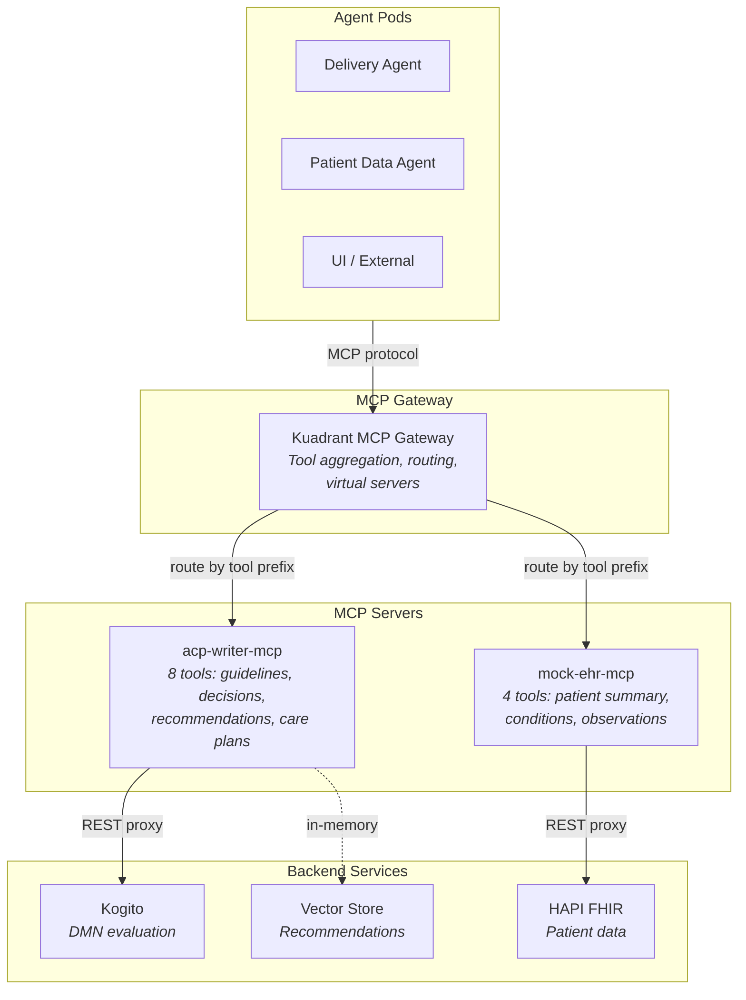

# MCP Gateway Integration

**Date:** 2026-07-22
**Status:** Deployed on OpenShift
**Branch:** `feature/phase3.3-integration-governance`
**Spike:** `dev_docs/spike-mcp-gateway.md`

## What It Does

MCP Gateway (Kuadrant/Envoy, Red Hat Connectivity Link) governs AI agent tool access at the application level. It aggregates multiple MCP servers behind a single endpoint, applies tool prefixing to avoid name collisions, and provides role-based tool filtering via virtual servers.

This complements OpenShell's network/kernel-level enforcement — together they provide defense-in-depth for the CPG-to-ACP pipeline.

## Architecture



## Deployed Resources

| Resource | Name | Status |
|---|---|---|
| Gateway | `cpg-gateway` | Accepted + Programmed |
| MCPGatewayExtension | `cpg-gateway-mcp` | Ready |
| Route | `cpg-gateway` | `cpg-mcp.apps.rosa.agentic-mcp.jolf.p3.openshiftapps.com` |
| Deployment | `acp-writer-mcp` | Running (port 8090) |
| Deployment | `mock-ehr-mcp` | Running (port 8090) |
| MCPServerRegistration | `acp-writer-mcp-server` | Ready, 8 tools discovered |
| MCPServerRegistration | `mock-ehr-mcp-server` | Ready, 4 tools discovered |
| MCPVirtualServer | `delivery-tools` | 4 tools |
| MCPVirtualServer | `patient-tools` | 3 tools |
| MCPVirtualServer | `careplan-tools` | 5 tools |

## Tool Catalog

12 tools aggregated behind the gateway with prefixed names:

| Tool | Server | Description |
|---|---|---|
| `acp_register_guideline` | acp-writer | Register CPG metadata |
| `acp_deploy_decision_model` | acp-writer | Deploy DMN XML |
| `acp_list_decision_models` | acp-writer | List deployed models |
| `acp_evaluate_decision` | acp-writer | Evaluate DMN via Kogito |
| `acp_ingest_recommendation` | acp-writer | Ingest single recommendation |
| `acp_ingest_recommendation_batch` | acp-writer | Batch ingest recommendations |
| `acp_search_recommendations` | acp-writer | Semantic search |
| `acp_generate_careplan` | acp-writer | Generate FHIR CarePlan |
| `ehr_get_patient_summary` | mock-EHR | Patient demographics + clinical data |
| `ehr_get_patient_conditions` | mock-EHR | Active conditions |
| `ehr_get_patient_observations` | mock-EHR | Observations with LOINC filter |
| `ehr_list_patients` | mock-EHR | List all patients |

## Virtual Servers (Role-Based Tool Filtering)

| Virtual Server | Role | Tools |
|---|---|---|
| `delivery-tools` | cpg-ingester Delivery agent | `acp_register_guideline`, `acp_deploy_decision_model`, `acp_ingest_recommendation`, `acp_ingest_recommendation_batch` |
| `patient-tools` | Patient Data agent | `ehr_get_patient_summary`, `ehr_get_patient_conditions`, `ehr_get_patient_observations` |
| `careplan-tools` | UI / external callers | `acp_generate_careplan`, `acp_list_decision_models`, `acp_evaluate_decision`, `acp_search_recommendations`, `ehr_list_patients` |

## MCP Server Implementation

Both MCP servers are standalone Starlette apps serving FastMCP over Streamable HTTP:

**acp-writer-mcp** (`acp_writer/mcp_proxy.py`):
- 8 tools, each backed by in-memory stores or REST proxies to pod-split services
- Guideline/recommendation management: in-memory (InMemoryVectorStore, GuidelinesStore)
- Decision evaluation: REST proxy to Kogito
- Care plan generation: REST proxy to FHIR Server pod

**mock-ehr-mcp** (`mock_ehr/mcp_app.py` + `mcp_server.py`):
- 4 tools, all proxying to HAPI FHIR via REST
- Stateless — all data comes from the FHIR server

### Compatibility Notes

Two compatibility issues were resolved with the MCP Gateway (Kuadrant v0.6.0):

1. **DNS rebinding protection** — The MCP SDK defaults to validating Host headers against localhost. Kubernetes service DNS names (`*.svc.cluster.local`) are rejected. Fixed by setting `enable_dns_rebinding_protection=False` in `TransportSecuritySettings`.

2. **Accept header** — The gateway sends `Accept: application/json` without `text/event-stream`, but the MCP SDK's Streamable HTTP transport requires both. Fixed by adding ASGI middleware that injects `text/event-stream` into the Accept header when missing.

Both fixes are gateway-version-specific and can be removed when the gateway upgrades to v0.7.1+.

## Verification

```bash
# Gateway endpoint
GATEWAY=https://cpg-mcp.apps.rosa.agentic-mcp.jolf.p3.openshiftapps.com

# Initialize session
curl -s -X POST "$GATEWAY/mcp" \
  -H "Content-Type: application/json" \
  -H "Accept: application/json, text/event-stream" \
  -d '{"jsonrpc":"2.0","id":1,"method":"initialize","params":{"protocolVersion":"2024-11-05","capabilities":{},"clientInfo":{"name":"test","version":"1.0"}}}'

# List all 12 tools (use Mcp-Session-Id from initialize response)
curl -s -X POST "$GATEWAY/mcp" \
  -H "Content-Type: application/json" \
  -H "Accept: application/json, text/event-stream" \
  -H "Mcp-Session-Id: <session-id>" \
  -d '{"jsonrpc":"2.0","id":2,"method":"tools/list","params":{}}'

# Call a tool
curl -s -X POST "$GATEWAY/mcp" \
  -H "Content-Type: application/json" \
  -H "Accept: application/json, text/event-stream" \
  -H "Mcp-Session-Id: <session-id>" \
  -d '{"jsonrpc":"2.0","id":3,"method":"tools/call","params":{"name":"ehr_list_patients","arguments":{}}}'
```

## Defense in Depth: OpenShell + MCP Gateway

| Layer | Mechanism | What It Prevents |
|---|---|---|
| **Network** (OpenShell) | Kernel-level egress policy | Compromised agent reaching unauthorized hosts |
| **Application** (MCP Gateway) | Tool-level routing + virtual servers | Agent seeing/calling unauthorized tools |
| **Protocol** (MCP SDK) | DNS rebinding protection | DNS rebinding attacks on MCP endpoints |

## Files

| File | Purpose |
|---|---|
| `acp-writer/src/acp_writer/mcp_proxy.py` | acp-writer MCP server (8 tools) |
| `mock-EHR/src/mock_ehr/mcp_app.py` | mock-EHR MCP server entry point |
| `mock-EHR/src/mock_ehr/mcp_server.py` | mock-EHR MCP tool definitions |
| `acp-writer/deploy/pods/Dockerfile.mcp` | acp-writer-mcp container image |
| `mock-EHR/deploy/Dockerfile.mcp` | mock-ehr-mcp container image |
| `deploy/mcp-gateway/gateway.yaml` | Gateway + MCPGatewayExtension + Route |
| `deploy/mcp-gateway/acp-writer-mcp.yaml` | acp-writer-mcp Deployment + Service |
| `deploy/mcp-gateway/mock-ehr-mcp.yaml` | mock-ehr-mcp Deployment + Service |
| `deploy/mcp-gateway/registrations.yaml` | HTTPRoutes + MCPServerRegistrations |
| `deploy/mcp-gateway/virtual-servers.yaml` | MCPVirtualServers |
