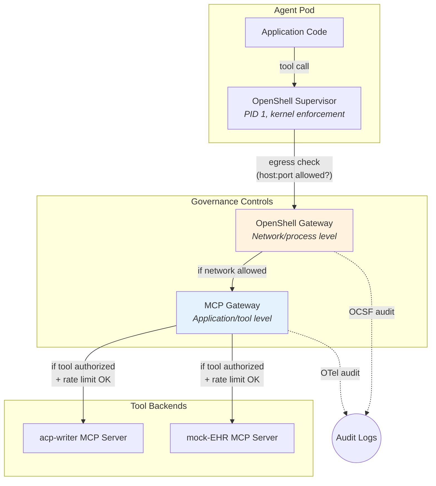

# Spike: MCP Gateway for Governed Tool Access

**Date:** 2026-07-22
**Status:** Complete
**Branch:** `feature/phase3.3-integration-governance`

## Decision

**MCP Gateway selected** for application-level tool governance (Red Hat Connectivity Link, built on Kuadrant/Envoy). It complements OpenShell's network/kernel-level enforcement — together they provide defense-in-depth for AI agent tool access.

## What is MCP Gateway?

MCP Gateway is an Envoy-based proxy that aggregates multiple MCP (Model Context Protocol) servers behind a single endpoint and applies enterprise governance: authentication, authorization, rate limiting, and audit logging.

### Product lineage

| Layer | Project | Notes |
|---|---|---|
| Upstream | [Kuadrant mcp-gateway](https://github.com/Kuadrant/mcp-gateway) | Apache-2.0, Go, v0.7.1 (alpha) |
| Product | Red Hat Connectivity Link 1.3 | Tech Preview, z-stream delivery |
| Platform | Red Hat OpenShift AI 3.4+ | MCP Catalog, identity-based tool filtering |

### Architecture

Three components bundled into a single binary:

- **Broker** — HTTP-facing MCP endpoint that aggregates tools from multiple backend MCP servers
- **Router** — gRPC ext_proc server for Envoy that handles routing decisions
- **Controller** — Kubernetes controller that watches custom resources and generates broker configuration

Agents receive a single `MCP_URL` environment variable and see an aggregated tool catalog — no need to know individual server locations.

### Custom resources

| CRD | API Group | Purpose |
|---|---|---|
| `MCPGatewayExtension` | `mcp.kuadrant.io/v1alpha1` | Extends an existing Gateway API gateway with MCP capabilities |
| `MCPServerRegistration` | `mcp.kuadrant.io/v1alpha1` | Registers a backend MCP server behind the gateway |
| `AuthPolicy` | `kuadrant.io/v1` | Applies authentication/authorization to the gateway's MCP listener |

### Deployment modes

1. **Standalone** — file-based YAML config, hot-reload on changes. Good for local development.
2. **Controller** — Kubernetes-native, watches `MCPServerRegistration` CRs, discovers servers via `HTTPRoute` references. For OpenShift deployment.

## Key Findings

### 1. Tool aggregation and federation

Multiple MCP servers are aggregated behind a single gateway endpoint. Each server registration includes a **tool prefix** to avoid naming collisions:

```yaml
apiVersion: mcp.kuadrant.io/v1alpha1
kind: MCPServerRegistration
metadata:
  name: acp-writer-tools
spec:
  toolPrefix: "acp_"
  targetRef:
    group: gateway.networking.k8s.io
    kind: HTTPRoute
    name: acp-writer-mcp-route
```

Our `acp_writer.deploy_decision_model` and `mock_ehr.get_patient_summary` become `acp_deploy_decision_model` and `ehr_get_patient_summary` behind the gateway. Agents see a single unified catalog.

### 2. Authentication and authorization

The gateway enforces OAuth 2.1 / JWT-based auth entirely decoupled from the model's reasoning:

```yaml
apiVersion: kuadrant.io/v1
kind: AuthPolicy
metadata:
  name: mcp-auth
spec:
  targetRef:
    group: gateway.networking.k8s.io
    kind: Gateway
    name: mcp-gateway
    sectionName: mcp
  defaults:
    rules:
      authentication:
        "keycloak":
          jwt:
            issuerUrl: http://keycloak.sschifma-cpg-to-acp.svc/realms/agents
```

Token claims determine which tools an agent can call. A prompt-injection attack that forces the model to call an unauthorized tool fails at the infrastructure layer — authorization is not the model's decision to make.

**Identity flow for our system:**

1. Each agent pod gets identity credentials (service account token or SPIFFE JWT-SVID)
2. Credentials are exchanged for short-lived access tokens with tool-scope claims
3. MCP Gateway inspects claims on every tool call
4. Only authorized tools are accessible; unauthorized calls return 403

### 3. Rate limiting

Applied through the standard Gateway API policy attachment mechanism (same as HTTP/gRPC APIs). Policies can target specific tools or tool groups. Relevant for our system:

- `generate_careplan` — triggers full LangGraph pipeline + LLM inference, expensive
- `deploy_decision_model` — modifies the decision engine state
- `ingest_recommendation_batch` — bulk vector store writes

### 4. Audit logging

The gateway supports OpenTelemetry for structured audit trails. Every tool call is logged with:
- Agent identity (which pod/service called)
- Tool name and arguments
- Timestamp and duration
- Success/failure status

This connects to our existing MLflow tracing — MLflow captures pipeline-internal traces, MCP Gateway captures tool-access-level audit.

### 5. Virtual servers

Tools can be grouped into focused subsets for delegation and token efficiency. For our system, this means agents only see tools relevant to their function — the cpg-ingester Delivery pod sees `acp_deploy_decision_model`, `acp_register_guideline`, `acp_ingest_recommendation_batch` but not `acp_generate_careplan` or `ehr_get_patient_summary`.

## Tools to Govern

### acp-writer MCP server (8 tools)

| Tool | Sensitivity | Callers | Notes |
|---|---|---|---|
| `register_guideline` | **Write** — creates CPG metadata | cpg-ingester Delivery | Must precede recommendation ingestion |
| `deploy_decision_model` | **Write** — modifies decision engine | cpg-ingester Delivery | DMN XML deployment |
| `list_decision_models` | Read | Any authorized agent | Informational |
| `evaluate_decision` | Read (compute) | acp-writer Decision Engine pod | DMN evaluation |
| `ingest_recommendation` | **Write** — vector store modification | cpg-ingester Delivery | Single recommendation |
| `ingest_recommendation_batch` | **Write** — bulk vector store modification | cpg-ingester Delivery | Batch recommendation ingestion |
| `search_recommendations` | Read | acp-writer LLM Reasoning pod | Semantic search during care plan composition |
| `generate_careplan` | **Write** — triggers full pipeline, LLM calls | External callers, UI | Most expensive operation |

### mock-EHR MCP server (4 tools)

| Tool | Sensitivity | Callers | Notes |
|---|---|---|---|
| `get_patient_summary` | **PHI** — returns patient clinical data | acp-writer Patient Data pod | Demographics, conditions, meds |
| `get_patient_conditions` | **PHI** — patient conditions | acp-writer Patient Data pod | Active conditions |
| `get_patient_observations` | **PHI** — patient observations | acp-writer Patient Data pod | Labs, vitals |
| `list_patients` | **PHI** — patient directory | UI pods | Patient selection |

### Sensitivity categories

- **PHI (Protected Health Information)** — clinical patient data; strictest access control, audit-all
- **Write** — modifies system state (decision engine, vector store, FHIR server); requires explicit authorization
- **Read** — informational queries; broader access but still audited

## Governance Policies

### Agent → tool access matrix

| Agent Pod | acp-writer tools | mock-EHR tools |
|---|---|---|
| **cpg-ingester Delivery** | `register_guideline`, `deploy_decision_model`, `ingest_recommendation`, `ingest_recommendation_batch` | None |
| **acp-writer Patient Data** | None | `get_patient_summary`, `get_patient_conditions`, `get_patient_observations` |
| **acp-writer LLM Reasoning** | `search_recommendations`, `list_decision_models` | None |
| **acp-writer Decision Engine** | `evaluate_decision` | None |
| **acp-writer FHIR Server** | None | None (writes to HAPI FHIR directly via REST, not MCP) |
| **cpg-ingester UI** | None | None |
| **acp-writer UI** | `generate_careplan`, `list_decision_models` | `list_patients` |
| All others | None | None |

### Rate limiting

| Tool | Limit | Rationale |
|---|---|---|
| `generate_careplan` | 10/minute | Full pipeline + LLM inference cost |
| `deploy_decision_model` | 5/minute | Decision engine state mutation |
| `ingest_recommendation_batch` | 20/minute | Bulk vector store writes |
| `get_patient_summary` | 30/minute | FHIR server load protection |

### Audit requirements

- **All tool calls** logged with agent identity, tool, arguments, result status, duration
- **PHI tools** (`get_patient_*`, `list_patients`) logged with enhanced detail for HIPAA compliance trail
- **Write tools** logged with before/after state where applicable
- Audit logs forwarded to centralized logging (same sink as OpenShell OCSF events)

## OpenShell + MCP Gateway: Defense in Depth

These are complementary controls at different layers, both part of the Red Hat AI governance story.



### What each layer prevents

| Threat | OpenShell | MCP Gateway |
|---|---|---|
| Compromised agent reaches unauthorized host | **Blocked** — kernel-level network policy | N/A (connection never reaches gateway) |
| Prompt injection forces call to unauthorized tool | Partially — if tool is on an allowed host, the connection succeeds | **Blocked** — JWT claims deny tool access regardless of prompt |
| Excessive API calls (DoS or runaway agent) | Not handled — connections are allowed/denied, not rate-limited | **Blocked** — rate limiting per tool |
| Agent calls authorized tool with malicious arguments | Not visible — network layer can't inspect MCP payloads | **Logged** — audit trail captures arguments for review |
| Data exfiltration through permitted endpoint | Not blocked — egress is allowed to that host | Not blocked — tool is authorized. Mitigated by inference guardrails (separate concern) |

### Key principle

Authorization is an infrastructure decision, not a model decision. Neither OpenShell nor MCP Gateway reads the prompt or relies on the model's judgment to enforce security. This is critical for clinical AI systems where prompt injection could redirect tool calls.

## Prototype Scope (Step 13)

### Prerequisites

- All 11 pod groups deployed on OpenShift (Steps 10-11)
- Red Hat Connectivity Link 1.3+ available on the cluster, OR standalone Kuadrant MCP Gateway deployed

### Tasks

1. **Deploy MCP Gateway** — install Connectivity Link operator or deploy standalone `mcp-gateway` to the namespace
2. **Create Gateway API resources** — Gateway + HTTPRoutes for acp-writer and mock-EHR MCP servers
3. **Register MCP servers** — `MCPServerRegistration` CRs for both servers with tool prefixes (`acp_`, `ehr_`)
4. **Configure identity** — Keycloak realm with per-agent clients, or service account token mapping
5. **Configure AuthPolicy** — JWT validation + claims-based tool filtering matching the access matrix above
6. **Configure rate limiting** — RateLimitPolicy on the gateway for expensive tools
7. **Demo scenario** — three-part demonstration:
   - **Authorized**: cpg-ingester Delivery pod calls `acp_deploy_decision_model` → succeeds
   - **Unauthorized**: same pod calls `ehr_get_patient_summary` → 403 denied
   - **Audit**: both calls visible in gateway audit logs with agent identity
8. **Document** — write up in `dev_docs/mcp-gateway-integration.md`

### Resource estimates

| Resource | What |
|---|---|
| MCP Gateway | 1 deployment (broker-router binary), 1 Redis for session store |
| Keycloak | 1 realm, ~11 clients (one per pod group), tool-scoped roles |
| Config | 2 MCPServerRegistrations, 1 MCPGatewayExtension, 1 AuthPolicy, 1 RateLimitPolicy |

### Open questions for Step 13

- **Connectivity Link availability** — is the operator available on our cluster, or do we deploy upstream Kuadrant standalone?
- **Identity provider** — Keycloak (standard with OpenShift), or service account token exchange?
- **MCP transport** — our current MCP servers use FastMCP with stdio transport. For the gateway, they need to serve over HTTP (Streamable HTTP). FastMCP supports this via `mcp.run(transport="streamable-http")` — may need a thin wrapper or deployment flag.

## References

- [MCP Gateway for Red Hat OpenShift (Tech Preview)](https://www.redhat.com/en/blog/control-your-ai-agent-traffic-scale-model-context-protocol-gateway-red-hat-openshift-now-technology-preview) — product announcement with YAML examples
- [Architect an Open Blueprint for Cloud-Native AI Agents](https://developers.redhat.com/articles/2026/07/20/architect-open-blueprint-cloud-native-ai-agents) — defense-in-depth architecture, SPIFFE identity, three rings model
- [Kuadrant MCP Gateway](https://github.com/Kuadrant/mcp-gateway) — upstream project (Apache-2.0, Go, v0.7.1)
- [MCP Specification](https://modelcontextprotocol.io/) — protocol spec, now under Agentic AI Foundation / Linux Foundation
- [OpenShell Agent Security](../docs/openshell-agent-security.md) — our OpenShell implementation (complementary)
