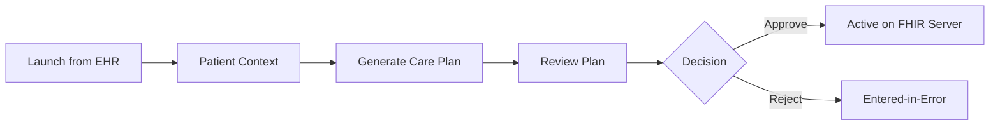

# Spike D: acp-writer UX Design

**Phase:** 4 | **Status:** Complete | **Date:** 2026-07-23

## User Profile

The acp-writer UI is used by **clinicians** (physicians, nurse practitioners, pharmacists) who review AI-generated care plans for their patients. They launch the app from within the mock-EHR in a patient's context, review the proposed care plan, and approve or reject it.

This is the user-facing clinical tool — UX quality matters significantly for the demo.

## Overall Flow



## Launch Pattern

The acp-writer UI launches via SMART on FHIR from the mock-EHR (see Spike E). It receives:
- **Patient ID** — who the care plan is for
- **Practitioner ID** — who the clinician is (for the approval signature)

For the Phase 4 demo without full SMART on FHIR, the patient can be selected from a dropdown or passed as a URL parameter.

## Screens

### 1. IPS (International Patient Summary) View

First screen after launch. Shows the complete IPS that will be sent to the backend for care plan generation. The clinician should see everything the AI will use — no hidden inputs.

The IPS is a standardized FHIR Bundle containing all clinically relevant patient data. The UI renders it in a readable format organized by IPS section:

```
┌──────────────────────────────────────────────────┐
│  Care Plan Generator                              │
├──────────────────────────────────────────────────┤
│  Patient International Patient Summary (IPS)      │
│  This data will be sent to generate the care plan │
├──────────────────────────────────────────────────┤
│  Demographics                                     │
│  ┌────────────────────────────────────────────┐   │
│  │ Name: James Reynolds                       │   │
│  │ DOB: 1971-03-15 (55M) | Gender: Male      │   │
│  │ MRN: P001 (http://example.org/fhir/ids)   │   │
│  └────────────────────────────────────────────┘   │
│                                                    │
│  Active Conditions                                 │
│  ┌────────────────────────────────────────────┐   │
│  │ Essential hypertension                     │   │
│  │   SNOMED: 59621000 | ICD-10: I10          │   │
│  │   Status: active | Onset: 2026-06-01      │   │
│  │                                            │   │
│  │ Type 2 diabetes mellitus                   │   │
│  │   SNOMED: 44054006 | ICD-10: E11          │   │
│  │   Status: active | Onset: 2022-08-15      │   │
│  └────────────────────────────────────────────┘   │
│                                                    │
│  Medications                                       │
│  ┌────────────────────────────────────────────┐   │
│  │ Metformin hydrochloride 500 MG Oral Tablet │   │
│  │   RxNorm: 860975                           │   │
│  │   Dosage: 500mg twice daily                │   │
│  │   Since: 2022-09-01                        │   │
│  └────────────────────────────────────────────┘   │
│                                                    │
│  Observations / Vitals                             │
│  ┌────────────────────────────────────────────┐   │
│  │ Blood Pressure (2026-07-01)                │   │
│  │   Systolic: 142 mmHg | Diastolic: 92 mmHg │   │
│  │   LOINC: 85354-9                           │   │
│  └────────────────────────────────────────────┘   │
│                                                    │
│  Allergies                                         │
│  ┌────────────────────────────────────────────┐   │
│  │ (none recorded)                            │   │
│  └────────────────────────────────────────────┘   │
│                                                    │
│  Immunizations                                     │
│  ┌────────────────────────────────────────────┐   │
│  │ (none in IPS)                              │   │
│  └────────────────────────────────────────────┘   │
│                                                    │
│  [Generate Care Plan]     [View FHIR Bundle JSON] │
└──────────────────────────────────────────────────┘
```

The UI renders ALL IPS sections present in the FHIR Bundle — not just a filtered summary. Each section uses PatternFly DataList with expandable detail panels. Sections with no data show "(none recorded)" rather than being hidden. A "View FHIR Bundle JSON" toggle shows the raw IPS Bundle for verification.

IPS sections to display (per the IPS IG):
- Demographics (Patient resource)
- Active conditions (Condition resources)
- Medications (MedicationStatement/MedicationRequest resources)
- Allergies (AllergyIntolerance resources)
- Observations / vitals (Observation resources)
- Immunizations (Immunization resources)
- Procedures (Procedure resources)
- Problems (from the problem list)
- Any other resources present in the Bundle

### 2. Generation Progress

After clicking "Generate Care Plan," shows the SonataFlow pipeline progress. Uses the same polling pattern as cpg-ingester (Spike B).

```
┌────────────────────────────────────────────┐
│  Generating Care Plan for James Reynolds   │
├────────────────────────────────────────────┤
│  ✅ Patient data scanned           2s      │
│  ✅ Guidelines resolved            8s      │
│  ✅ DMN decisions evaluated        3s      │
│  ✅ Recommendations retrieved      2s      │
│  ⏳ Composing care plan...       running   │
│  ○  Generating FHIR bundle                │
│  ○  Clinical review                        │
│  ○  Writing to FHIR server                │
├────────────────────────────────────────────┤
│  Applicable Guidelines:                    │
│  • Hypertension Management (SYN-HTN)       │
│  • Type 2 Diabetes Management (SYN-DM2)    │
│                                            │
│  🤖 Plan Composer                          │
│  Composing care plan using 12 recommendations│
│  from 2 clinical practice guidelines...    │
└────────────────────────────────────────────┘
```

The AI reasoning section uses the PatternFly ChatBot message pattern — showing the LLM's work as it happens.

### 3. Care Plan Review

The main review screen. Shows the complete care plan in a clinician-readable format — NOT raw FHIR JSON.

#### Layout

```
┌─────────────────────────────────────────────────────────┐
│  Care Plan Review                        [Approve] [Reject]│
│  Patient: James Reynolds | Status: Draft                │
├──────────┬──────────────────────────────────────────────┤
│ Goals    │  Goal 1: Reduce BP below 130/80 mmHg        │
│ ────────│  Target: 130/80 | Current: 142/92            │
│ Activities│  Due: 3 months                              │
│ ────────│                                              │
│ Meds     │  Goal 2: Maintain HbA1c below 7%            │
│ ────────│  Target: <7% | Due: 6 months                │
│ Monitoring│                                             │
│ ────────│──────────────────────────────────────────────│
│ AI Info  │  Activities for Goal 1:                      │
│ ────────│  💊 Start Lisinopril 10mg daily              │
│ Conflicts│     Source: HTN CPG §3.1 (strong-for)       │
│          │     ⓘ AI-generated from recommendation      │
│          │  📋 Blood pressure monitoring every 2 weeks  │
│          │     Source: HTN CPG §3.5                     │
│          │  🏃 150 min/week moderate exercise           │
│          │     Source: HTN CPG §3.4                     │
└──────────┴──────────────────────────────────────────────┘
```

#### Care Plan Sections (left nav tabs)

| Tab | Content |
|---|---|
| **Goals** | Treatment goals with target values and timelines |
| **Activities** | Medications, procedures, lifestyle, monitoring — grouped by goal |
| **Medications** | Medication-specific activities with dosing, route, frequency |
| **Monitoring** | Lab orders, vital checks, follow-up schedules |
| **AI Info** | AI Transparency: which parts were AI-generated, model used, confidence |
| **Conflicts** | Multi-CPG conflicts (if applicable) — overlapping recommendations |

#### Activity Detail

Each activity card shows:

| Element | Content |
|---|---|
| **Type icon** | 💊 medication, 📋 monitoring, 🏃 lifestyle, 🔬 procedure |
| **Description** | Plain-language activity description |
| **Source** | CPG name + section + recommendation title |
| **Strength** | Evidence strength badge (Strong For, Conditional, etc.) |
| **AI indicator** | `ⓘ AI-generated` label (AI Transparency IG compliance) |
| **Rationale** | Expandable: why this activity was recommended |

### 4. AI Transparency

Dedicated tab showing how the AI generated this care plan. Required for AI Transparency IG compliance (AIAST / CLINAST_AIRPT).

| Element | Content |
|---|---|
| **AI Device** | Model name (gpt-5.6-terra), provider, version |
| **Generation method** | "AI-generated care plan from clinical practice guidelines" |
| **Provenance** | For each activity: which recommendation, which CPG, which section |
| **Confidence indicators** | Reviewer feedback (approved, flagged) |
| **Status** | AIAST (AI-generated) → CLINAST_AIRPT (clinician-approved) on approval |

### 5. Conflict Display

When multiple CPGs apply (e.g., hypertension + diabetes), some recommendations may overlap or conflict.

| Element | Content |
|---|---|
| **Conflict list** | PatternFly Alert: overlapping medication recommendations |
| **Each conflict** | Which CPGs, which recommendations, what overlaps |
| **Resolution** | Phase 4: display only. Phase 8: interactive clinician resolution |

Example:
```
⚠️ Overlapping Recommendation
Both HTN CPG and DM2 CPG recommend Lisinopril (ACE inhibitor).
HTN: 10mg initial, DM2: 10-20mg for renal protection.
Both included in care plan — clinician should reconcile dosing.
```

### 6. Approval / Rejection

| Action | What happens |
|---|---|
| **Approve** | Status → `active`, AIAST → CLINAST_AIRPT, written to FHIR server. Clinician name recorded. |
| **Reject** | Status → `entered-in-error`, reason recorded. |
| **Approve dialog** | Confirmation with clinician name, optional notes |
| **Reject dialog** | Reason required (free text) |

## FHIR Bundle Visualization

The raw FHIR Bundle is complex JSON. The UI translates it into the clinician-readable format above. For developers/informaticists, a "View FHIR" toggle shows the raw JSON in a PatternFly CodeBlock with syntax highlighting.

## Async Interaction Pattern

Per Spike B:
1. UI sends patient IPS bundle to `POST /acpwriter` (SonataFlow workflow)
2. Polls `GET /acpwriter/{id}` for progress
3. As each step completes, updates the progress display
4. When `writeResult` appears in the state, shows the review screen
5. Approve/reject calls `PUT /api/v1/careplans/{id}/status` directly through the API gateway

## PatternFly Components Used

| Component | Where |
|---|---|
| Page, PageSection, PageSidebar | Overall layout with left nav |
| DescriptionList | Patient demographics |
| DataList | Conditions, medications, vitals |
| Card, CardBody | Activity cards, goal cards |
| Tabs | Care plan sections (goals, activities, meds, monitoring, AI info) |
| Label | Evidence strength, AI-generated indicators |
| Alert | Conflicts, validation warnings |
| ProgressStepper | Pipeline progress |
| CodeBlock | FHIR JSON view |
| Modal | Approve/reject confirmation dialogs |
| ChatBot (Message) | AI reasoning display during generation |
| Badge | Activity type icons |
| ExpandableSection | Rationale, source details |

## References

- Spike A: Technology stack (PatternFly 6, React, TypeScript)
- Spike B: Backend interaction (polling, async pattern)
- Spike E: mock-EHR (SMART on FHIR launch)
- `acp-writer/src/acp_writer/services/` — service APIs
- `acp-writer/deploy/orchestrator/acp-writer-workflow.yaml` — SonataFlow workflow
- AI Transparency on FHIR IG — AIAST/CLINAST_AIRPT status tags
