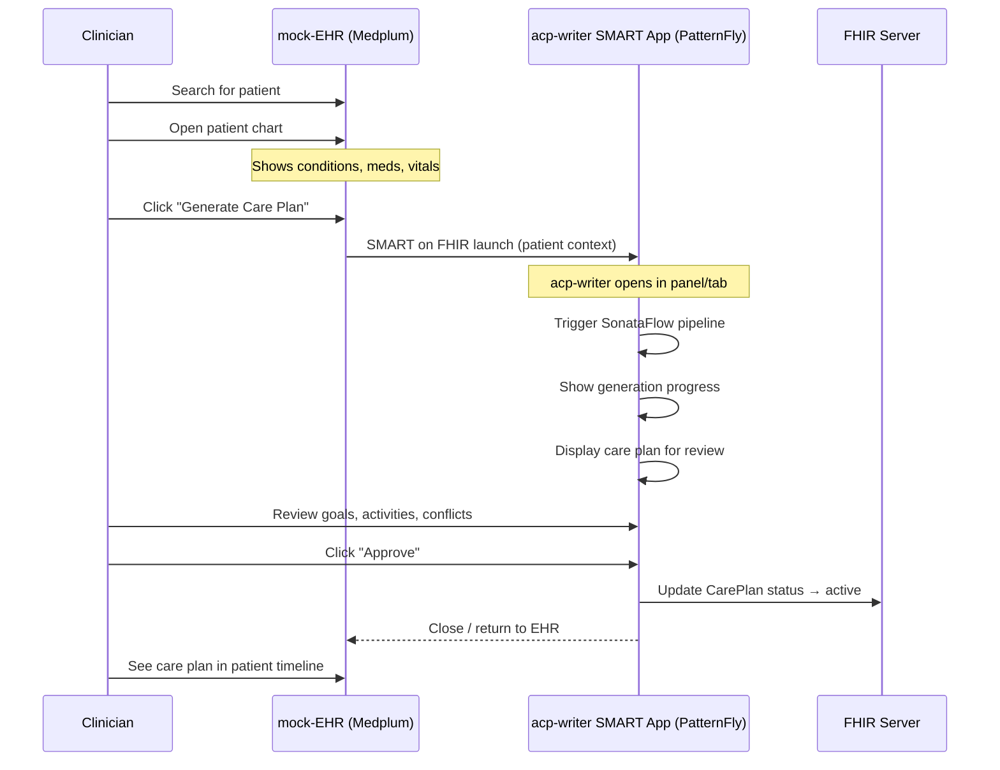

# Spike E: mock-EHR Research

**Phase:** 4 | **Status:** Complete | **Date:** 2026-07-23

## Problem

We need a mock-EHR that:
1. Shows a patient list with clinical data
2. Launches the acp-writer as a SMART on FHIR app in patient context
3. Works with our existing HAPI FHIR server (patient data, care plans)
4. Runs on OpenShift

## Options Evaluated

### Option 1: Full Medplum (replace HAPI FHIR)

[Medplum](https://www.medplum.com/) is a full FHIR platform — server, React UI, SMART on FHIR, OAuth, Helm charts.

| Aspect | Assessment |
|---|---|
| FHIR server | FHIR R4, PostgreSQL-backed, US Core compliant |
| React UI | Tightly coupled to Medplum server SDK (`@medplum/react` depends on `@medplum/core` which targets Medplum's API) |
| SMART on FHIR | Built-in OAuth server, EHR launch + standalone launch |
| Self-hosting | Helm charts available, primarily AWS-oriented |
| License | Apache 2.0 |

**Verdict: STRONG CANDIDATE — reconsider.** Medplum provides a complete out-of-the-box EHR experience: patient search, charting (conditions, medications, vitals, care plans), care coordination, messaging, scheduling, and SMART on FHIR launch. Building all of this from scratch in PatternFly would be weeks of work that Medplum provides for free.

The migration from HAPI FHIR is manageable: Medplum is FHIR R4 compliant, so the same patient bundles and care plan resources work. The cpg-ingester delivery and acp-writer FHIR server writer just point to Medplum's FHIR endpoint instead of HAPI FHIR's. Patient data loads via Medplum's API the same way.

The React components ARE tightly coupled to Medplum's server, but that's fine if we use Medplum as the server. The coupling is a feature — the UI and server work together seamlessly.

### Option 2: HAPI FHIR + Medplum React Components

Use `@medplum/react` components against our existing HAPI FHIR backend.

**Verdict: NOT viable.** Research confirms `@medplum/react` depends on `@medplum/core` which is built for Medplum's API specifically (authentication, subscriptions, GraphQL). It's not a generic FHIR React library.

### Option 3: HAPI FHIR + SMART-EHR-Launcher (CSIRO) ← Recommended

[SMART-EHR-Launcher](https://github.com/aehrc/SMART-EHR-Launcher) is an open-source EHR simulator from CSIRO (Australia's national science agency). It's a React + TypeScript SPA built with Vite — exactly our tech stack.

| Aspect | Assessment |
|---|---|
| Technology | React, TypeScript, Vite — matches our Spike A stack perfectly |
| FHIR support | Works with any FHIR R4 server (uses the [smart-launcher-v2](https://github.com/smart-on-fhir/smart-launcher-v2) proxy to add SMART App Launch to vanilla FHIR servers) |
| SMART on FHIR | Full EHR launch flow with OAuth2 authorization_code + PKCE |
| Patient display | Shows conditions, medications, allergies, observations, encounters |
| Customization | Open source, React components, easy to modify look and feel |
| License | Apache 2.0 |
| Auth requirement | Uses the smart-launcher-v2 proxy as the OAuth server — no Keycloak needed |

**Key insight:** The smart-launcher-v2 proxy sits between the EHR-Launcher and our HAPI FHIR server. It handles the OAuth flow (authorization_code grant), injects patient context, and proxies FHIR requests. This means we get SMART on FHIR launch **without Keycloak and without replacing HAPI FHIR.**

```
┌─────────────┐     ┌──────────────────┐     ┌─────────────┐
│  SMART-EHR  │────>│ smart-launcher-v2│────>│  HAPI FHIR  │
│  Launcher   │     │  (OAuth proxy)   │     │  (existing)  │
│  (React UI) │     │                  │     │             │
└─────────────┘     └──────────────────┘     └─────────────┘
       │
       │ EHR Launch
       ▼
┌─────────────┐
│ acp-writer  │
│    UI       │
│ (SMART app) │
└─────────────┘
```

### Option 4: HAPI FHIR + Custom PatternFly UI

Build the mock-EHR from scratch using PatternFly components.

**Verdict: Wrong approach.** The mock-EHR is NOT a Red Hat product — it represents a generic hospital EHR. It should NOT use PatternFly. Using PatternFly would make it look like the same product as the acp-writer, which defeats the purpose of showing the acp-writer launching inside a third-party system.

## Key Design Principle

> **The mock-EHR and the acp-writer UI are deliberately different products with different visual identities.**
>
> - **mock-EHR** = a generic hospital EHR (Medplum's look, or clinical dashboard styling). Not a Red Hat product.
> - **acp-writer UI** = a SMART on FHIR app that launches INSIDE the EHR. This IS the Red Hat AI product. Uses PatternFly.
>
> The demo story: *"Here's a clinician working in their hospital's EHR. They select a patient, click 'Generate Care Plan,' and our SMART app launches. The clinician reviews the AI-generated plan, makes adjustments, approves it, and returns to their EHR."*

## The Workflow



## Decision

**Full Medplum as the mock-EHR.**

Medplum provides a complete EHR experience (patient search, charting, care coordination, SMART on FHIR) out of the box. Its UI does NOT use PatternFly — which is exactly what we want. It looks like a generic clinical system, distinct from the acp-writer.

| Pro | Con |
|---|---|
| Complete EHR UI for free (patient search, chart, care plans) | Replace HAPI FHIR with Medplum's FHIR server |
| SMART on FHIR built in (no Keycloak needed) | Need to validate FHIR R4 compatibility with our bundles |
| Does NOT look like PatternFly (correct — it's a different product) | Adds a dependency on Medplum's ecosystem |
| Self-hostable (Docker, Helm) | Learning curve for Medplum configuration |
| Clinician sees care plan appear in the EHR after approval | Migration effort from HAPI FHIR |

**Fallback:** If Medplum doesn't work out, use SMART-EHR-Launcher (CSIRO) as the EHR shell + smart-launcher-v2 for OAuth. This is lighter but provides fewer EHR features.

SMART-EHR-Launcher is useful as a reference and for early testing, but the demo EHR needs to be built with PatternFly to match the Red Hat AI look and feel and to provide adequate clinical functionality.

### mock-EHR Features (provided by Medplum)

| Feature | Medplum provides? | Notes |
|---|---|---|
| Patient search | Yes | Built-in FHIR search |
| Patient list / worklist | Yes | Configurable |
| Patient demographics | Yes | Standard patient view |
| Conditions list | Yes | Charting module |
| Medications list | Yes | Charting module |
| Observations / vitals | Yes | Charting module |
| Allergies | Yes | Charting module |
| Care plan list | Yes | Care coordination module |
| SMART app launch | Yes | Built-in OAuth + app management |
| Encounter context | Yes | SMART launch context |

### What Gets Built vs What Gets Reused

| Component | Build or Reuse |
|---|---|
| EHR UI (patient search, chart, clinical views) | Reuse Medplum app |
| SMART on FHIR OAuth flow | Reuse Medplum built-in |
| FHIR server | Reuse Medplum (replaces HAPI FHIR) |
| acp-writer SMART app (PatternFly) | Build (Phase 4 step 4.3) |
| Patient data | Load into Medplum (same FHIR bundles) |

## Deployment on OpenShift

| Component | Pod | Image |
|---|---|---|
| **Medplum server** | `mock-ehr-server` | [Medplum](https://github.com/medplum/medplum) (Node.js + PostgreSQL) |
| **Medplum app** | `mock-ehr-app` | Medplum frontend (React, NOT PatternFly) |
| **acp-writer SMART app** | `acp-writer-ui` | Our React/PatternFly app (launches via SMART) |

Note: Medplum replaces both HAPI FHIR and the mock-EHR UI in one package.

## Look and Feel

- **mock-EHR (Medplum):** Clinical dashboard — Medplum's own design. Looks like a generic hospital EHR. NOT PatternFly, NOT Red Hat branded.
- **acp-writer SMART app:** PatternFly 6 design system. Clearly a different product that launched inside the EHR. Red Hat AI look and feel (without Red Hat logo/name).
- The visual contrast between the two is intentional — it demonstrates that the acp-writer works as a SMART app inside ANY EHR.

## Phase 4 Integration Steps

1. Fork SMART-EHR-Launcher and smart-launcher-v2
2. Configure smart-launcher-v2 to proxy to our HAPI FHIR server
3. Deploy both as pods on OpenShift
4. Register acp-writer UI as a SMART app with the proxy
5. Test: click patient → launch acp-writer → generate care plan

## References

- [SMART-EHR-Launcher](https://github.com/aehrc/SMART-EHR-Launcher) — CSIRO EHR simulator (Apache 2.0)
- [smart-launcher-v2](https://github.com/smart-on-fhir/smart-launcher-v2) — SMART App Launch proxy
- [Medplum](https://www.medplum.com/) — evaluated but not selected
- [Medplum SMART on FHIR Demo](https://github.com/medplum/medplum-smart-on-fhir-demo)
- [SMART on FHIR Spec](https://docs.smarthealthit.org/)
- [Inferno SMART Test Kit](https://inferno.healthit.gov/test-kits/smart-app-launch/) — for conformance testing
