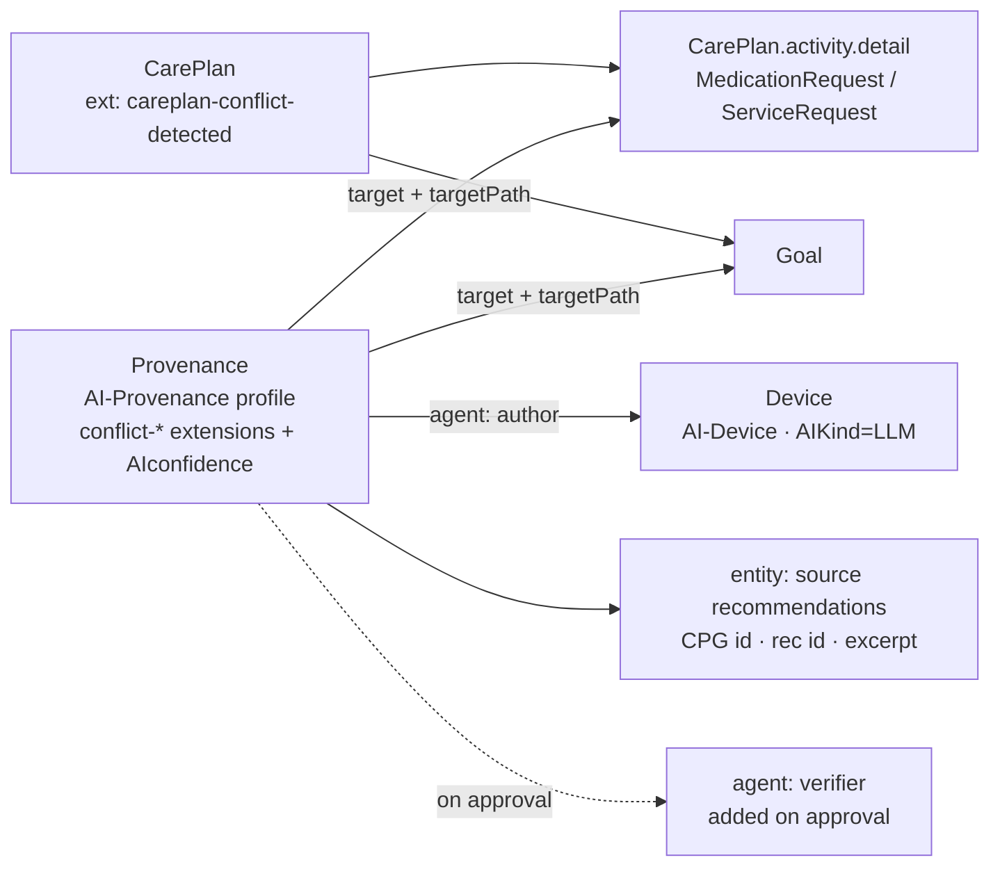

# AI Transparency on FHIR

`acp-writer` generates care plans with an LLM, so every bundle it produces is
labelled and traceable to the AI that asserted it. It targets the HL7
[**AI Transparency on FHIR IG**](https://build.fhir.org/ig/HL7/aitransparency-ig).
Note the distinction between two URLs: the IG's **canonical base** —
`http://hl7.org/fhir/uv/aitransparency` (un-hyphenated `aitransparency`) — is the
identity stamped into profile and extension URLs on generated resources; it is
not a browsable page until the IG is published. The current build is browsable at
`https://build.fhir.org/ig/HL7/aitransparency-ig`. This page describes what the
system implements, how plan-level **conflicts** are recorded, the custom
extensions it defines, and the reviewer-identity seam.

The builders live in [`acp-writer/src/acp_writer/services/ai_transparency.py`](../acp-writer/src/acp_writer/services/ai_transparency.py).

## What the IG contributes

| IG artifact | How acp-writer uses it |
|---|---|
| **AI-Device** | One `Device` per bundle carrying `AIKind = Large-Language-Models` and the model id. Every AI-Provenance names this Device as its `author` agent. |
| **AI-Provenance** | Profile applied to **all** Provenance resources — the bundle-level derivation Provenance, per-activity source Provenances, and the conflict Provenances. Each carries the `AIAST` reason slice, an AI agent with a fixed AI role, and `occurredDateTime`. |
| **AI-InputPrompt** | When `ACP_CAPTURE_PROMPTS=true`, each rendered LLM prompt (composer, conflict analyst, …) is emitted as a `DocumentReference` so the exact input is auditable. |
| **AI-ModelCard** | When `LLM_MODEL_CARD_URL` is set, a `DocumentReference` pointing at the model card is included. |
| **AIAST security label** | `meta.security` tag (`AIAST`, "Artificial Intelligence asserted") on every AI-produced resource. On clinician approval it is swapped to `CLINAST_AIRPT` (clinician-attested AI report). |
| **AIconfidence** | Categorical extension on each conflict Provenance and per-activity Provenance, bound to the `certainty-rating` value set (`high` / `moderate` / `low` / `very-low`; the LLM's "medium" maps to `moderate`). |
| **Human verifier** | On approval, a `verifier` human agent (the reviewer — reference + identifier) is appended to every AI-Provenance. |

### Approval transition

When a clinician approves a plan:

1. `AIAST` → `CLINAST_AIRPT` on every resource's `meta.security`.
2. A `verifier` human agent (the reviewer) is appended to each AI-Provenance.
3. Each conflict Provenance's `conflict-status` flips `detected` → `acknowledged`.

## Conflict surfacing as Provenance

Plan-level conflicts (see the [acp-writer README](../acp-writer/README.md#conflict-surfacing)
for the categories) are recorded **without mutating the plan**. Each conflict is
one AI-Provenance that:

- **targets** the affected `CarePlan.activity[].detail` / `Goal` resources via
  the stock [`targetPath`](http://hl7.org/fhir/StructureDefinition/targetPath)
  extension on `Provenance.target`;
- lists the **source recommendations** as `Provenance.entity` items (CPG id,
  recommendation id, and an excerpt encoded in the entity's `what.display`);
- carries an **AI-authored rationale** in `Provenance.note`;
- stores machine-readable metadata in the custom extensions below (read-back
  never parses the note text — only the extensions and entities).

The CarePlan itself carries exactly **one** `careplan-conflict-detected` marker
extension (a boolean) so a consumer can tell at a glance that conflicts exist.

Conflicts are read back from these Provenances when a stored plan is viewed, so
they remain visible outside the live run-review window (see
`services/ai_transparency.py::plan_conflict_from_provenance` and
`services/bff.py`).

## Custom extensions

Extensions the IG does not define use the base
`https://github.com/samschifman/cpg-to-acp/fhir/StructureDefinition`
(`ACP_EXT_BASE`):

| Extension URL (suffix) | On | Value | Purpose |
|---|---|---|---|
| `careplan-conflict-detected` | CarePlan | `boolean` | Marker that ≥1 conflict exists |
| `conflict-id` | Provenance | `string` | Semantic (index-free) conflict id; stable across regeneration |
| `conflict-description` | Provenance | `string` | Clinician-legible summary |
| `conflict-severity` | Provenance | `code` | `info` / `warning` / `critical` |
| `conflict-category` | Provenance | `code` | `overlap` / `contradiction` / `divergent_target` / `divergent_schedule` / `other` |
| `conflict-status` | Provenance | `code` | `detected` / `acknowledged` / `resolved` |

The `conflict-id` is derived from the category, sources, and a semantic
content-key (not list indices) so the same conflict keeps its id when the plan
is regenerated during a request-changes loop.

## Reviewer identity (SMART-on-FHIR seam)

The human verifier recorded on approval comes from a `ReviewerContext`
(`services/reviewer.py`) that resolves in priority order:

1. **request** — a reviewer supplied on the approval call (`source="request"`);
2. **config** — the deploy-time default from `ACP_REVIEWER_DISPLAY` /
   `ACP_REVIEWER_REFERENCE` / `ACP_REVIEWER_ID_SYSTEM` / `ACP_REVIEWER_ID_VALUE`
   (`source="config"`);
3. **smart** — reserved for a future SMART-on-FHIR launch context
   (`source="smart"`).

Wiring the request/config path now keeps the SMART launch itself out of scope
while leaving a clean seam to add it later.

## Configuration

| Env var | Effect |
|---|---|
| `ACP_CAPTURE_PROMPTS` | `true` → emit AI-InputPrompt DocumentReferences |
| `LLM_MODEL_CARD_URL` | URL → emit an AI-ModelCard DocumentReference |
| `ACP_REVIEWER_DISPLAY` | Default verifier display name |
| `ACP_REVIEWER_REFERENCE` | Default verifier FHIR reference |
| `ACP_REVIEWER_ID_SYSTEM` | Default verifier identifier system |
| `ACP_REVIEWER_ID_VALUE` | Default verifier identifier value |

## Out of scope / future work

- **Per-conflict resolution recording** — letting a clinician resolve an
  individual conflict during review and recording it (status `resolved` +
  resolution note authored by the reviewer) on the conflict Provenance is
  tracked in [#172](https://github.com/samschifman/cpg-to-acp/issues/172). The
  data model already supports it (`conflict-status` reaches `resolved`,
  `ConflictEntry` carries a `resolution`, and `_carry_forward` copies the status
  onto regenerated conflicts); only the trigger + SonataFlow structured-feedback
  plumbing remain. <!-- TODO(#172): per-conflict resolution recording -->
- **Conflict *resolution* UI** — a "keep A / keep B / keep both" workflow built
  on top of that recording path is future work toward
  [#56](https://github.com/samschifman/cpg-to-acp/issues/56).
- **SMART on FHIR launch** — only the `ReviewerContext` seam exists today.
