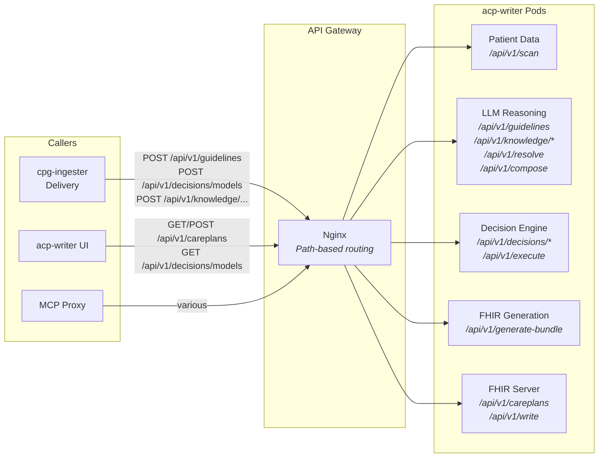

# API Gateway for Pod-Split Services

This document describes the API gateway that provides a unified REST interface to the acp-writer pod-split deployment. External callers see one URL; the gateway routes each request to the correct backend pod by path.

## Why an API Gateway?

The acp-writer is decomposed into 5 pods by security profile (see [Agent Security with OpenShell](openshell-agent-security.md)). Each pod runs a subset of the API — Patient Data handles `/api/v1/scan`, the Decision Engine handles `/api/v1/decisions/*`, and so on.

Without a gateway, every caller needs to know which pod handles which endpoint. The cpg-ingester Delivery agent would need separate URLs for guideline registration (LLM Reasoning pod) and DMN model deployment (Decision Engine pod). The UI would need to know that care plan approval goes to the FHIR Server pod while recommendation search goes to LLM Reasoning.

The API gateway makes the pod split transparent. Callers send all requests to `http://acp-writer-api:8080`, and the gateway routes by path.

## Architecture



## Routing Table

All requests go to `http://acp-writer-api:8080`. The gateway routes by path prefix:

| Path | Backend Pod | Purpose |
|---|---|---|
| `/api/v1/scan` | `acp-patient-data` | Extract patient data from FHIR IPS Bundle |
| `/api/v1/decisions/` | `acp-decision-engine` | Deploy, list, evaluate DMN models |
| `/api/v1/execute` | `acp-decision-engine` | Execute DMN models (pipeline step) |
| `/api/v1/guidelines` | `acp-llm-reasoning` | Register/list clinical practice guidelines |
| `/api/v1/knowledge/` | `acp-llm-reasoning` | Ingest and search recommendations |
| `/api/v1/resolve` | `acp-llm-reasoning` | Resolve applicable guidelines (pipeline step) |
| `/api/v1/retrieve` | `acp-llm-reasoning` | Retrieve recommendations (pipeline step) |
| `/api/v1/compose` | `acp-llm-reasoning` | Compose care plan brief (pipeline step) |
| `/api/v1/review-fhir` | `acp-llm-reasoning` | Review FHIR bundle (pipeline step) |
| `/api/v1/generate-bundle` | `acp-fhir-generation` | Generate FHIR Bundle + validate |
| `/api/v1/careplans` | `acp-fhir-server` | Care plan CRUD and lifecycle |
| `/api/v1/write` | `acp-fhir-server` | Write FHIR Bundle to server |
| `/health` | Gateway (direct) | Gateway health check |

## Implementation

The gateway is an Nginx reverse proxy deployed as a Kubernetes Deployment + ConfigMap + Service:

- **ConfigMap** (`acp-writer-api-gateway`) — contains `nginx.conf` with the routing rules
- **Deployment** (`acp-writer-api`) — runs the UBI9 Nginx image, mounts the config
- **Service** (`acp-writer-api`) — ClusterIP on port 8080

Timeouts are set to 600 seconds to accommodate LLM inference calls (plan composition, FHIR generation).

## Callers

| Caller | Env Var | Value |
|---|---|---|
| cpg-ingester Delivery | `ACP_WRITER_URL` | `http://acp-writer-api:8080` |
| acp-writer UI | `API_URL` | `http://acp-writer-api:8080` |
| acp-writer MCP Proxy | `FHIR_SERVER_URL` | `http://acp-writer-api:8080` (optional — can call pods directly) |

## Relationship to Other Gateways

This project has three gateway layers, each at a different level:

| Gateway | Level | Purpose |
|---|---|---|
| **API Gateway** (this doc) | HTTP path routing | Unifies pod-split services behind one URL |
| **[MCP Gateway](mcp-gateway-tool-governance.md)** | MCP protocol | Governs AI agent tool access with identity + filtering |
| **[OpenShell](openshell-agent-security.md)** | Network/kernel | Enforces per-pod network policies at the kernel level |

The API gateway handles infrastructure routing. MCP Gateway handles application-level tool governance. OpenShell handles network-level security. They operate independently and complement each other.

## Deployment

```bash
oc apply -f deploy/mcp-gateway/acp-writer-api-gateway.yaml
```

## Further Reading

- [Agent Security with OpenShell](openshell-agent-security.md) — why the pods are split
- [Tool Governance with MCP Gateway](mcp-gateway-tool-governance.md) — application-level tool access control
- [acp-writer OpenAPI spec](../acp-writer/api/openapi.yaml) — full API surface definition
