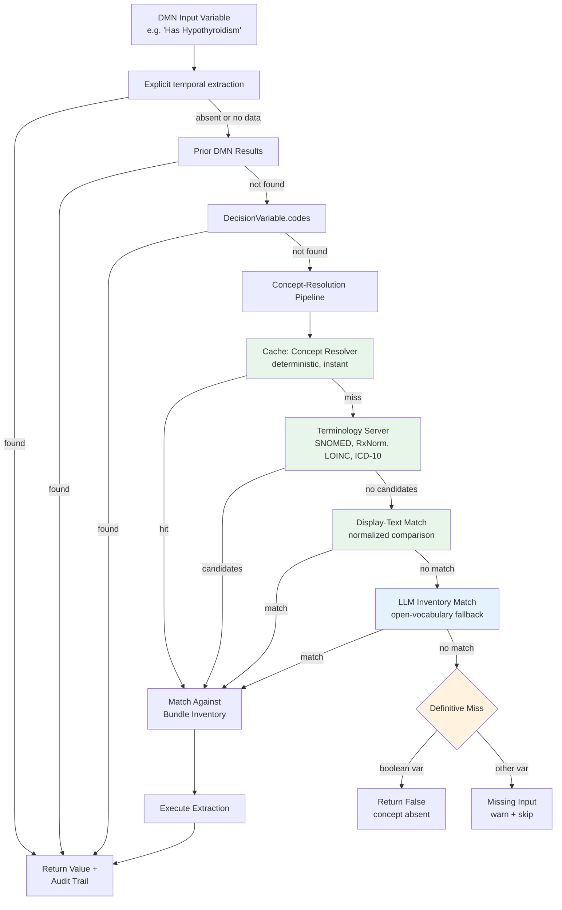

# Clinical Data Question Answering

This document describes how `acp-writer` answers clinical questions about patient data from FHIR IPS (International Patient Summary) bundles. The system extracts patient data to supply input values for DMN decision execution and care plan composition.

## Production Architecture

The DMN executor uses a **concept-resolution pipeline** to map variable names to FHIR data. The full pipeline — including LLM-assisted resolution — runs in production. Deterministic steps fire first; the LLM is the last resort by construction.



### Layer 1: Explicit extraction metadata

An explicit `DecisionVariable.extraction` annotation takes precedence when a
CPG requires a temporal aggregation. It names one of the five temporal
primitives and carries JSON parameters; the executor records the function,
parameters, data quality, and FHIR provenance in the audit trail. If the
annotation is absent or has insufficient data, normal chained-result and
patient-data resolution continues.

### Layer 2: Prior DMN Results

When DMN models are chained (one model's output feeds another's input), the
executor checks prior results after any explicit extraction annotation. For
example, the "Monitoring Plan" model takes "Treatment Action" as input — this
value comes from the "Treatment Recommendation" model's output, not from the
IPS.

### Layer 3: DecisionVariable.codes

If `cpg-ingester` provides clinical terminology codes on DMN input variables (e.g., `["http://loinc.org|8480-6"]` for systolic BP), the executor uses them directly. This is the most reliable path — exact code matching, no ambiguity.

### Layer 4: Concept-Resolution Pipeline

The pipeline resolves clinical terms to FHIR data through a cascade of increasingly capable steps:

1. **Cache (concept resolver)** — a deterministic map of ~100 common clinical terms to FHIR codes. Fast path, no network or LLM calls. The map is a *cache*, not the coverage mechanism — terms not in the map fall through to the next step.

2. **Terminology server** — queries SNOMED CT (tx.fhir.org), RxNorm (RxNav), LOINC and ICD-10-CM (NLM Clinical Tables) to find candidate codes for the term. Results cached with 30-day TTL.

3. **Display-text matching** — normalized comparison of the term against the bundle's resource display texts. Catches resources coded in unexpected systems (e.g. ICD-10 instead of SNOMED) or free-text medications without coded entries.

4. **LLM inventory match** — a focused structured-output call where the LLM matches the term against the bundle's complete code inventory. This is the open-vocabulary fallback that handles terms no deterministic step can resolve. Runs only when steps 1–3 miss.

A **definitive miss** (all four steps failed) means the concept is genuinely absent from the bundle. For boolean DMN inputs, this produces `False`; for other types, the input is treated as missing (warn + skip). An *unresolved* result (LLM unavailable) is treated as a missing input, never as a fabricated `False`.

### Degraded Mode

If the LLM endpoint is unavailable, the pipeline runs deterministic steps only (cache + terminology + display text). Unresolved concepts become missing inputs — the executor continues with a warning, and the audit trail records `degraded: true`. LLM failure never aborts DMN execution.

### Audit Trail

Each extracted input records:
- `match_basis` — which pipeline step produced the resolution (cache, terminology, display_text, llm_inventory, definitive_miss, prior_dmn, decision_variable_codes)
- `steps_run` — which pipeline steps were attempted
- `degraded` — whether the LLM step was unavailable
- FHIR provenance references

## Answer Verification (Guardrails)

Every answer passes through a verification choke point before leaving the system. Guardrails are dispatched by **answer-type contract**:

| Answer class | Evidence contract | Guardrails |
|---|---|---|
| **Numeric retrieval** ("What is the TSH?") | Cited resource must contain the value and match the asked concept | value-consistency, concept-consistency, conflict, provenance |
| **Boolean presence** ("Does the patient have X?") | The matched resource IS the evidence | provenance, conflict |
| **Boolean absence** ("Is the patient missing X?") | Tool-call ledger confirms definitive miss, or on-demand pipeline verification | ledger-backed absence check, conflict |
| **Composite reasoning** ("Is the patient on GDMT?") | Provenance set is plausible; cited observations not conflicted | provenance (multi-resource), conflict |

Key properties:
- **Fail closed** — unverifiable citations downgrade to insufficient_data rather than passing
- **Mechanical refusal** — absence/refusal decisions are made by code, not by the agent; definitive-miss signals override agent claims
- **Independent verification** — concept-consistency uses terminology cross-checks independent of the resolution pipeline that produced the answer

**Composite reasoning answers are the verification-weakest class** — mechanical checks can validate evidence plausibility (provenance exists, no conflicting values) but cannot validate clinical logic itself.

## Extraction Functions

All extraction functions are in `acp-writer/src/acp_writer/tools/ips_extractor.py` and return an `ExtractionResult` with `found`, `value`, `unit`, `date`, `fhir_reference`, and `resource_type`.

| Function | FHIR Resource | What it returns |
|---|---|---|
| `extract_observation` | Observation | Most recent value by code. Supports `valueQuantity`, `valueCodeableConcept`, `valueString`, `valueBoolean`, `valueRange`. Checks both top-level code and components (for panels like BP). |
| `extract_condition` | Condition | Boolean: active condition with matching code present? Excludes resolved/inactive/remission. |
| `extract_medication` | MedicationStatement, MedicationRequest | Boolean: active medication with matching code present? Excludes cancelled/entered-in-error/stopped. |
| `extract_allergy` | AllergyIntolerance | Boolean: active allergy with matching code present? |
| `extract_procedure` | Procedure | Boolean: procedure with matching code present? Excludes entered-in-error/not-done. |
| `extract_family_history` | FamilyMemberHistory | Boolean: family history entry with matching condition code? |
| `extract_diagnostic_report` | DiagnosticReport | Boolean: report with matching code present? Excludes entered-in-error/cancelled. |
| `extract_patient_age` | Patient | Computed age in years from birthDate relative to a reference date. |

## Temporal Queries

For explicit DMN temporal annotations and QA questions, the system builds an
in-memory **temporal index** (`acp-writer/src/acp_writer/tools/temporal_index.py`)
that groups observations by code and date, then provides five named primitives
(`acp-writer/src/acp_writer/tools/temporal_queries.py`):

| Primitive | What it computes | Example |
|---|---|---|
| `observations_in_window` | All observations of a code within a time window | "HbA1c readings in the last 3 months" |
| `observation_count` | Count of observations matching a threshold in a window | "How many BP readings >= 140 in the past 3 months?" |
| `consecutive_above` | Count from most recent backward, stopping at first at-or-below | "Consecutive high BP readings" |
| `rate_of_change` | Least-squares slope normalized per year | "eGFR decline rate" |
| `cross_resource_temporal` | Whether a target observation exists within a window after an anchor medication start | "Was BMP drawn within 2 weeks of starting lisinopril?" |

## Benchmarking

The QA system includes a benchmark harness (`acp-writer/src/acp_writer/benchmark/`) for measuring accuracy:

```bash
# Run the 50-question smoke suite
python -m acp_writer.benchmark run --suite smoke --backend current --no-mlflow

# Run the 230-question standard suite
python -m acp_writer.benchmark run --suite standard --backend current --no-mlflow
```

Two registered backends: `current` (deterministic) and `llm-assisted` (query planner + tool agent). Use `python -m acp_writer.benchmark list` to see available suites and backends.

Additional modules used by the LLM-assisted path:
- `acp-writer/src/acp_writer/tools/ips_serializer.py` — condensed IPS serialization for LLM context
- `acp-writer/src/acp_writer/tools/query_planner.py` — LLM query plan synthesis
- `acp-writer/src/acp_writer/tools/qa_agent.py` — LangGraph ReAct agent with concept-based tools
- `acp-writer/src/acp_writer/tools/bundle_inventory.py` — bundle code inventory for pipeline matching
- `acp-writer/src/acp_writer/tools/concept_resolution.py` — the concept-resolution pipeline
- `acp-writer/src/acp_writer/tools/terminology_lookup.py` — multi-system terminology lookup with caching

See `acp-writer/benchmarks/README.md` for details on adding test cases and backends.

## Design Decisions

- **DMN is the sole clinical logic formalism.** No CQL engine. Temporal semantics are encoded in named Python primitives whose parameters appear in the audit trail.
- **Deterministic first, LLM fallback.** The concept resolver cache + terminology + display-text matching handle most concepts without LLM calls. The LLM inventory-match fires only when cheaper steps miss.
- **The concept map is a cache.** Coverage comes from terminology servers, display-text matching, and the LLM — not from expanding the map. The map improves efficiency for common terms.
- **Graph traversal evaluated and set aside.** A NetworkX graph-backed backend was benchmarked against flat extraction on a 200-question suite. Both scored 74.5%. Graph adds infrastructure complexity without measurable accuracy improvement at IPS scale.
- **Fail-closed verification.** Every answer passes through guardrails dispatched by answer type. Refusal is mechanical — code decides, not the agent.
