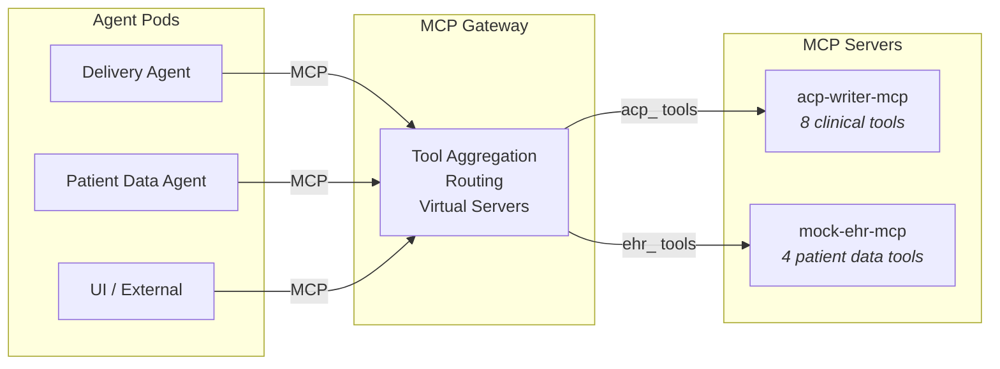
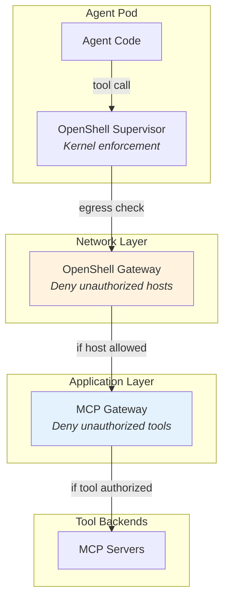

# Tool Governance with MCP Gateway

This document describes how the CPG-to-ACP system uses [MCP Gateway](https://github.com/Kuadrant/mcp-gateway) (Red Hat Connectivity Link) to govern AI agent tool access on OpenShift, ensuring that each agent can only use the tools it needs.

## Why MCP Gateway?

When AI agents can call tools — deploy decision models, query patient records, generate care plans — the question isn't just *can they reach the endpoint* (that's [OpenShell's job](openshell-agent-security.md)), but *should they be calling this tool at all?*

A cpg-ingester Delivery agent needs to deploy decision models and ingest recommendations. It should never query patient records. An agent compromised by prompt injection might try to call any tool the model knows about — but if the infrastructure only offers it the four tools it needs, the attack surface shrinks to those four.

MCP Gateway operates at the application level: it aggregates tools from multiple MCP servers, applies identity-based filtering, and routes tool calls to the correct backend. Every call is logged. Combined with OpenShell's network-level enforcement, this creates defense-in-depth where authorization is an infrastructure decision, not a model decision.

## How It Works

MCP Gateway is an Envoy-based proxy that sits between AI agents and MCP tool servers. It speaks the [Model Context Protocol](https://modelcontextprotocol.io/) (MCP) — the open standard for AI agent tool interaction.

Key capabilities:

- **Tool aggregation** — Multiple MCP servers appear as one. Agents connect to a single gateway endpoint and see a unified tool catalog.
- **Tool prefixing** — Each server's tools get a namespace prefix (`acp_`, `ehr_`) to avoid name collisions.
- **Virtual servers** — Tools are grouped into role-specific subsets. An agent connecting to a virtual server only sees the tools assigned to its role.
- **Audit logging** — Every tool call is logged with the caller's identity, tool name, and result.

## Tool Catalog

The gateway aggregates 12 tools from two MCP servers:

### acp-writer tools (prefix: `acp_`)

| Tool | What It Does | Sensitivity |
|---|---|---|
| `acp_register_guideline` | Register a clinical practice guideline | Write |
| `acp_deploy_decision_model` | Deploy DMN decision logic | Write |
| `acp_list_decision_models` | List deployed models | Read |
| `acp_evaluate_decision` | Evaluate a DMN model via Kogito | Read (compute) |
| `acp_ingest_recommendation` | Add a recommendation to the knowledge base | Write |
| `acp_ingest_recommendation_batch` | Batch-add recommendations | Write |
| `acp_search_recommendations` | Semantic search over recommendations | Read |
| `acp_generate_careplan` | Generate a FHIR CarePlan from patient data | Write (expensive) |

### mock-EHR tools (prefix: `ehr_`)

| Tool | What It Does | Sensitivity |
|---|---|---|
| `ehr_get_patient_summary` | Patient demographics, conditions, medications | PHI |
| `ehr_get_patient_conditions` | Active conditions for a patient | PHI |
| `ehr_get_patient_observations` | Observations with optional LOINC filter | PHI |
| `ehr_list_patients` | List all patients | PHI |

## Virtual Servers

Virtual servers define which tools each agent role can access. An agent connecting to a virtual server endpoint sees only its assigned tools — the rest don't exist from its perspective.

```mermaid
graph TB
    subgraph catalog["Full Catalog — 12 tools"]
        T1["acp_register_guideline"]
        T2["acp_deploy_decision_model"]
        T3["acp_ingest_recommendation"]
        T4["acp_ingest_recommendation_batch"]
        T5["acp_generate_careplan"]
        T6["acp_list_decision_models"]
        T7["acp_evaluate_decision"]
        T8["acp_search_recommendations"]
        T9["ehr_get_patient_summary"]
        T10["ehr_get_patient_conditions"]
        T11["ehr_get_patient_observations"]
        T12["ehr_list_patients"]
    end

    subgraph vs["Virtual Servers"]
        D["delivery-tools<br/><i>4 tools</i>"]
        P["patient-tools<br/><i>3 tools</i>"]
        C["careplan-tools<br/><i>5 tools</i>"]
    end

    T1 & T2 & T3 & T4 --> D
    T9 & T10 & T11 --> P
    T5 & T6 & T7 & T8 & T12 --> C

    style D fill:#fff3e0
    style P fill:#e3f2fd
    style C fill:#e8f5e9
```

| Virtual Server | Agent Role | Tools |
|---|---|---|
| **delivery-tools** | cpg-ingester Delivery — deploys CPG artifacts | `acp_register_guideline`, `acp_deploy_decision_model`, `acp_ingest_recommendation`, `acp_ingest_recommendation_batch` |
| **patient-tools** | Patient Data — queries clinical records | `ehr_get_patient_summary`, `ehr_get_patient_conditions`, `ehr_get_patient_observations` |
| **careplan-tools** | UI and external callers — generates care plans | `acp_generate_careplan`, `acp_list_decision_models`, `acp_evaluate_decision`, `acp_search_recommendations`, `ehr_list_patients` |

## Defense in Depth: OpenShell + MCP Gateway

These are complementary controls at different layers, both part of the Red Hat AI governance story.

| Threat | OpenShell (Network) | MCP Gateway (Application) |
|---|---|---|
| Agent reaches unauthorized host | **Blocked** | N/A |
| Prompt injection forces unauthorized tool call | Partially (if tool is on allowed host) | **Blocked** (tool not in virtual server) |
| Excessive API calls (runaway agent) | Not rate-limited | Rate limiting available |
| Tool call with malicious arguments | Not visible | **Logged** for audit |

The key principle: authorization is an infrastructure decision, not a model decision. Neither OpenShell nor MCP Gateway reads the prompt. A prompt injection that tricks the model into calling an unauthorized tool fails at the infrastructure layer.

## Further Reading

- [MCP Gateway (Kuadrant)](https://github.com/Kuadrant/mcp-gateway) — upstream open source project
- [Model Context Protocol](https://modelcontextprotocol.io/) — protocol specification (Agentic AI Foundation / Linux Foundation)
- [Agent Security with OpenShell](openshell-agent-security.md) — network-level enforcement in this project
- [MCP Gateway for Red Hat OpenShift](https://www.redhat.com/en/blog/control-your-ai-agent-traffic-scale-model-context-protocol-gateway-red-hat-openshift-now-technology-preview) — Red Hat product announcement
