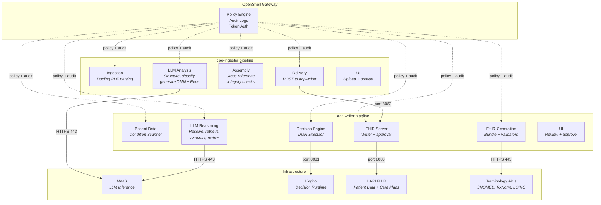
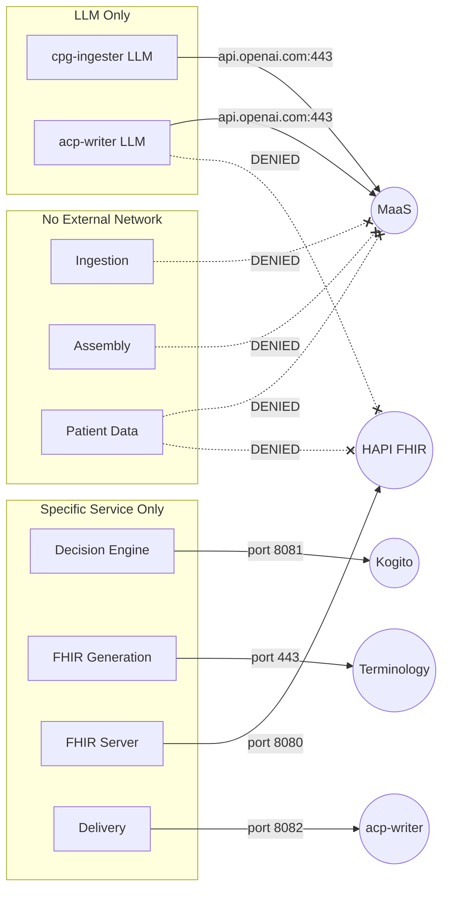
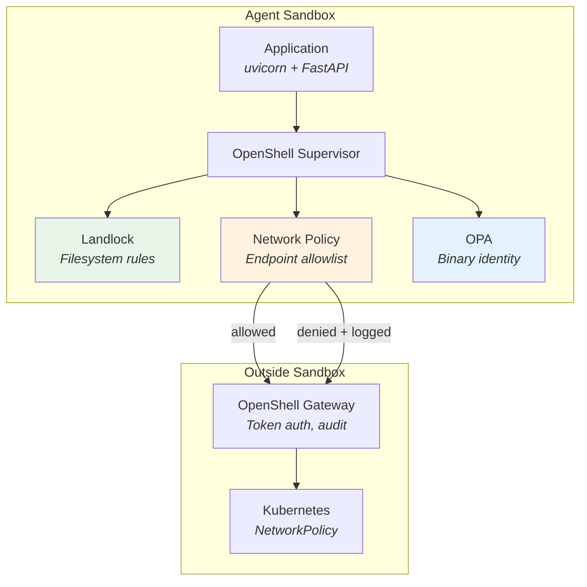

# Agent Security with OpenShell

This document describes how the CPG-to-ACP system uses [NVIDIA OpenShell](https://github.com/NVIDIA/openshell) to enforce per-agent security policies on OpenShift, ensuring that each AI agent can only access the resources it needs.

## Why OpenShell?

This system handles clinical data — patient records, medication decisions, diagnostic information. When AI agents process this data, we need guarantees stronger than "the code doesn't try to exfiltrate." We need enforcement at the kernel level that a compromised or misbehaving agent *cannot* reach endpoints it shouldn't, regardless of what the application code does.

Kubernetes NetworkPolicies operate at the pod network layer, but they can't distinguish between binaries inside a container or audit individual connections. OpenShell provides process-level enforcement: it intercepts every outbound connection, checks it against a declarative policy, and logs the result — allowed or denied — as a structured audit event (OCSF).

The result is a system where the LLM Reasoning agent physically cannot reach the FHIR server, the Patient Data agent cannot reach the LLM, and the Decision Engine can only reach Kogito — all enforced at the kernel level and auditable in the OpenShell gateway logs.

## How It Works

OpenShell runs as a per-namespace gateway that manages sandboxed pods. Each agent pod runs inside an OpenShell sandbox with three layers of enforcement:

- **Landlock filesystem sandbox** — kernel-level restriction on which paths are read-only vs. read-write, preventing agents from modifying system binaries or reading files outside their scope.
- **Network policy engine** — every outbound TCP connection is intercepted and checked against a per-sandbox policy that specifies allowed hosts, ports, and protocols. Connections to unlisted endpoints are denied.
- **Binary identity tracking** — OPA-based enforcement that tracks which binary (e.g., `python3`, `uvicorn`) initiated each connection, enabling policies that restrict specific binaries to specific endpoints.

## Architecture

The system is split into 11 agent pods across two pipelines (cpg-ingester and acp-writer), each running in its own OpenShell sandbox with a tailored security policy.

### Pod-level view



### Network access matrix

Each sandbox policy defines exactly which endpoints the agent can reach. Everything not listed is denied.



### Policy details

| Agent Pod | Allowed Network | Denied | Filesystem |
|---|---|---|---|
| **Ingestion** | Gateway only | LLM, FHIR, external | RO: system; RW: /app, /tmp |
| **LLM Analysis** | MaaS (api.openai.com:443) | FHIR server, patient data | RO: system; RW: /app, /tmp |
| **Assembly** | Gateway only | LLM, FHIR, external | RO: system; RW: /app, /tmp |
| **Delivery** | acp-writer API (port 8082) | LLM, FHIR, external | RO: system; RW: /app, /tmp |
| **Patient Data** | Gateway only | LLM, FHIR server, external | RO: system; RW: /app, /tmp |
| **LLM Reasoning** | MaaS (api.openai.com:443) | FHIR server, Kogito | RO: system; RW: /app, /tmp |
| **Decision Engine** | Kogito (port 8081) | LLM, FHIR, external | RO: system; RW: /app, /tmp |
| **FHIR Generation** | Terminology APIs (HTTPS) | LLM, FHIR server, patient data | RO: system; RW: /app, /tmp |
| **FHIR Server** | HAPI FHIR (port 8080) | LLM, patient data, external | RO: system; RW: /app, /tmp |

### Enforcement layers

Each sandbox enforces security through multiple independent mechanisms:



1. **Landlock** (kernel) — 17 filesystem rules enforced before the application starts. System directories are read-only; application directories are read-write.
2. **Network Policy** (supervisor) — every TCP connection intercepted. The policy defines which host:port combinations are allowed. Unlisted destinations are denied and logged.
3. **Binary Identity** (OPA) — tracks which executable initiated each connection. Policies can restrict specific binaries to specific endpoints.
4. **Gateway Audit** (OCSF) — all connection events (open, close, deny) are logged as structured OCSF events, visible via `openshell logs <sandbox>`.

## Audit Trail

Every network connection is logged as an OCSF (Open Cybersecurity Schema Framework) event:

```
[ocsf] NET:OPEN [INFO] api.openai.com:443/tcp
[ocsf] NET:CLOSE [INFO] api.openai.com:443/tcp
[ocsf] CONFIG:BUILT [INFO] Landlock ruleset built [rules_applied:17 skipped:0]
[ocsf] CONFIG:CONFIGURED [INFO] OPA runtime binary identity mode configured
```

These logs are collected by the OpenShell gateway and can be forwarded to centralized logging for compliance auditing. Every allowed and denied connection is recorded with the sandbox ID, timestamp, binary path, and destination.

## Future Direction

- **Per-binary network policies** — restrict specific Python processes to specific endpoints (e.g., only the embedding model binary can reach the vector store).
- **MCP Gateway integration** — combine OpenShell's network-level enforcement with MCP Gateway's application-level tool governance for defense-in-depth.
- **Inference routing** — use OpenShell's built-in inference privacy router to strip caller credentials and inject backend credentials, ensuring agents never see real API keys.
- **Policy Advisor** — enable agents to request additional network access through structured proposals that a human reviews and approves.
- **SPIFFE/SPIRE identity** — replace service account tokens with SPIFFE-based workload identity for cross-cluster agent authentication.

## Further Reading

- [NVIDIA OpenShell Documentation](https://docs.nvidia.com/openshell/)
- [OpenShell GitHub Repository](https://github.com/NVIDIA/openshell)
- [Sandbox Policies Reference](https://docs.nvidia.com/openshell/sandboxes/policies)
- [OCSF (Open Cybersecurity Schema Framework)](https://ocsf.io/)
