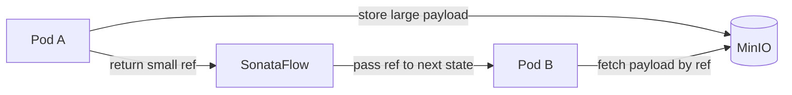

# Workflow Orchestration with SonataFlow

This document describes how the CPG-to-ACP system uses [SonataFlow](https://sonataflow.org/) (part of Apache KIE) to orchestrate the multi-step pipelines that transform clinical practice guidelines into patient-specific care plans.

## Why SonataFlow?

Each pipeline involves multiple pods performing distinct tasks — PDF parsing, LLM analysis, DMN execution, FHIR generation — that must execute in a specific order with data flowing between them. Rather than building custom orchestration logic, SonataFlow provides:

- **Declarative workflows** — YAML-based state machine definitions following the [Serverless Workflow Specification](https://serverlessworkflow.io/)
- **Async callback support** — long-running LLM operations (12-25 minutes) use callback events instead of blocking HTTP connections
- **Automatic retry and error handling** — built into the SonataFlow runtime
- **OpenShift-native deployment** — runs as a Kubernetes operator with CRDs

## Architecture

```mermaid
graph LR
    subgraph cpg["cpg-ingester pipeline"]
        P[Parse<br/><i>async callback</i>] --> A[Analyze<br/><i>async callback</i>]
        A --> ASM[Assemble<br/><i>sync</i>]
        ASM --> D[Deliver<br/><i>sync</i>]
    end

    subgraph acp["acp-writer pipeline"]
        S[Scan Patient<br/><i>sync</i>] --> R[Resolve<br/><i>sync</i>]
        R --> E[Execute DMN<br/><i>sync</i>]
        E --> RET[Retrieve Recs<br/><i>sync</i>]
        RET --> C[Compose Plan<br/><i>async callback</i>]
        C --> G[Generate FHIR<br/><i>async callback</i>]
        G --> REV[Review FHIR<br/><i>async callback</i>]
        REV -->|pass| W[Write FHIR<br/><i>sync</i>]
        REV -->|fail| G
    end

    D -->|delivers CPG artifacts| S
```



### Two pipelines

**cpg-ingester** (`cpg-ingester/deploy/orchestrator/cpg-ingester-workflow.yaml`):
1. **Parse** (async) — Docling ML extracts markdown from PDF (~30-120s)
2. **Analyze** (async) — LLM extracts structure, classifications, DMN models, recommendations (~12-25 min)
3. **Assemble** (sync) — cross-references and integrity checks (<1s)
4. **Deliver** (sync) — POSTs guidelines, DMN models, and recommendations to acp-writer (~10-30s)

**acp-writer** (`acp-writer/deploy/orchestrator/acp-writer-workflow.yaml`):
1. **Scan Patient** (sync) — extract conditions, medications, demographics from IPS
2. **Resolve Guidelines** (sync) — match patient conditions to registered CPGs and DMN models
3. **Execute DMN** (sync) — run matched DMN decision models against patient data via Kogito
4. **Retrieve Recommendations** (sync) — fetch relevant recommendations from vector store
5. **Compose Plan** (async) — LLM generates care plan with goals and activities
6. **Generate FHIR** (async) — LLM produces FHIR CarePlan bundle
7. **Review FHIR** (async) — semantic validation with retry loop (up to 4 iterations)
8. **Write FHIR** (sync) — POST bundle to HAPI FHIR server

### Sync vs async states

**Sync states** (`type: operation`) make a REST call and wait for the response. Used for fast, bounded operations (<30s).

**Async states** (`type: callback`) make a REST call that starts background work, then wait for a callback event. The service pod calls back to `http://<workflow>:80/wait-<phase>` when done. Used for long-running LLM and ML operations where holding an HTTP connection open would time out.

## State Transfer via MinIO

SonataFlow passes data between states as JSON in the workflow state object. For large payloads (IPS bundles, FHIR bundles, recommendation sets), this hits Vert.x payload size limits in the SonataFlow runtime.

The solution is **reference-based state transfer** using MinIO (S3-compatible object storage):



1. The producing pod stores the large payload in MinIO and returns a `_ref` key (e.g., `ips_bundle_ref: "cpg-phi:abc123/ips_bundle.json"`)
2. SonataFlow passes the small ref string through the workflow state
3. The consuming pod calls `resolve_ref()` to fetch the payload from MinIO

### Two-bucket PHI separation

MinIO is configured with two buckets enforcing data classification:

| Bucket | Contents | Access |
|---|---|---|
| `cpg-artifacts` | Non-PHI clinical content: recommendations, DMN models, analysis results, assembly results | All pipeline pods |
| `cpg-phi` | Patient-specific data: IPS bundles, planning briefs, FHIR care plan bundles | Patient-data, FHIR-generation, FHIR-server pods only |

The `cpg_contracts` package provides `get_artifact_store()` and `get_phi_store()` helpers that return store instances configured for the appropriate bucket.

### Inline fallback

When `ARTIFACT_STORE_URL` is not set (local development), the stores return `None` and data flows inline through the workflow state. The `store_artifact()` and `resolve_ref()` helpers handle both modes transparently:

```python
_, ref = store_artifact(store, "key.json", large_data)
# ref is "bucket:key" if store is available, None if inline

data = resolve_ref(incoming, "field_name", store)
# fetches from MinIO if field_name_ref exists, otherwise returns inline data
```

## Deployment

### SonataFlow operator

The SonataFlow operator must be installed on the OpenShift cluster. Workflows are deployed as `SonataFlow` custom resources:

```bash
oc apply -f cpg-ingester/deploy/orchestrator/cpg-ingester-workflow.yaml
oc apply -f acp-writer/deploy/orchestrator/acp-writer-workflow.yaml
```

The operator creates a pod for each workflow that exposes a REST API for starting and querying workflow instances.

### MinIO

MinIO is deployed as a single-pod service for development/demo. Production deployments should use a managed S3 service or multi-node MinIO.

```bash
oc apply -f deploy/platform/minio.yaml
```

Pods connect via `ARTIFACT_STORE_URL=http://minio:9000` with access keys configured via `ARTIFACT_STORE_ACCESS_KEY` and `ARTIFACT_STORE_SECRET_KEY`.

### OpenShell integration

When running with OpenShell sandboxing, the MinIO endpoint requires:
- Short hostname (`minio`) and FQDN in the network policy
- `allowed_ips` with the cluster service CIDR (MinIO resolves to a private ClusterIP)
- No `access` or `protocol` fields on the endpoint (avoids L7 HTTP inspection that breaks S3 signatures)

See [Agent Security with OpenShell](openshell-agent-security.md) for details.

## Monitoring

### Workflow instances

Query active and completed workflow instances:

```bash
# List active cpg-ingester workflows
curl https://<cpgingester-route>/cpgingester

# Get specific workflow status
curl https://<cpgingester-route>/cpgingester/<workflow-id>

# List active acp-writer workflows  
curl https://<acpwriter-route>/acpwriter
```

### MLflow tracing

All pipeline nodes are traced with `@mlflow.trace`. SonataFlow state transitions appear as spans in the MLflow trace UI, showing the full pipeline execution timeline.

## Further Reading

- [SonataFlow Documentation](https://sonataflow.org/serverlessworkflow/latest/)
- [Serverless Workflow Specification](https://serverlessworkflow.io/)
- [MinIO Documentation](https://min.io/docs/)
- [Artifact Store Spike](../dev_docs/spikes/spike-artifact-store.md) — design rationale for MinIO integration
- [SonataFlow Orchestration Spike](../dev_docs/spikes/spike-sonataflow-orchestration.md) — evaluation and pattern selection
